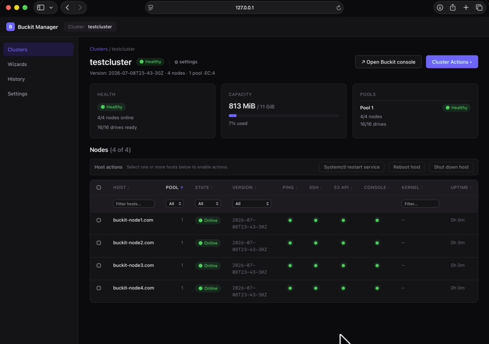

> [!NOTE]
> Buckit is an independent project derived from the discontinued open source
> [MinIO](https://github.com/minio/minio) project. Buckit is not affiliated
> with or endorsed by MinIO, Inc.

# Buckit Object Storage

<p align="center">
  <a href="https://github.com/buckit-io/buckit/actions/workflows/go-cross.yml">
    
  </a>
  <a href="https://github.com/buckit-io/buckit/actions/workflows/vulncheck.yml">
    
  </a>
  <a href="https://buckit.sh">
    
  </a>
  <a href="https://discord.gg/v5utBPpsGu">
    
  </a>
</p>

Buckit is an open-source, S3-compatible object storage system you run on your
own commodity servers. It gives your applications an Amazon S3-style API while
keeping your data under your control, and it can scale from a small setup to
hundreds of petabytes. Teams use Buckit when they want S3-like storage without
sending all data to a public cloud or paying cloud storage bills at scale.

<p align="center">
  
</p>

## Learn More

<a href="https://buckit.sh/#showcase-video" target="_blank" rel="noopener noreferrer">Watch demo videos</a><br>
<a href="https://buckit.sh/#getting-started" target="_blank" rel="noopener noreferrer">Getting Started</a><br>
<a href="https://buckit.sh/#faq" target="_blank" rel="noopener noreferrer">FAQ</a><br>
<a href="https://buckit.sh/docs" target="_blank" rel="noopener noreferrer">Documentation</a><br>
<a href="https://buckit.sh/blog/why-i-forked-minio-to-keep-it-open-and-made-it-faster" target="_blank" rel="noopener noreferrer">Blog: Why I Forked MinIO to Keep It Open, and Made It Faster</a>

<br>

> [!TIP]
> **Already running MinIO?** Buckit is a drop-in replacement. Read
> [MinIO to Buckit: Swap One File, Nothing Else](https://buckit.sh/blog/minio-to-buckit-swap-one-file).

## What Buckit Provides

- **S3-compatible object storage** — works with existing S3 SDKs and tools.
- **Standalone mode** — single-node for small setups or homelabs.
- **Distributed mode** — multi-node clusters supporting hundreds of petabytes.
- **Replication** — keep remote sites in sync for high availability and
  disaster recovery.
- **Single binary** — one executable per node, with no external dependencies.
- **Browser console** — self-service bucket and object management for end
  users.
- **Operations toolkit** — CLI for admin and object automation, web-based
  cluster and node management.

## Quickstart

> [!NOTE]
> This quickstart runs the server by hand for learning purposes.
> For real-world deployments, use the
> [guided deployment wizard](https://buckit.sh/#getting-started).

Let's start the object storage server, create a bucket, upload a file into it,
and verify using the web UI.

### 1. Download the server

```sh
# Linux or macOS
curl -fsSL https://buckit-io.github.io/buckit/install-binary.sh | sh

# Windows PowerShell
irm https://buckit-io.github.io/buckit/install-windows.ps1 | iex
```

### 2. Start the server

```sh
./buckit server /tmp/buckit-data --console-address :9001
```

Objects are stored in `/tmp/buckit-data`. The S3 API listens on port 9000 and
the console on 9001.

### 3. Create a bucket and upload a file using CLI

```sh
# Install the bm client on Linux or macOS
curl -fsSL https://buckit-io.github.io/bm/install.sh | sh

# Windows PowerShell
# irm https://buckit-io.github.io/bm/install.ps1 | iex

# bm installs to ~/.local/bin; skip this if that is already on your PATH
export PATH="$HOME/.local/bin:$PATH"

# Point bm at the server, naming this connection "local"
bm alias set local http://localhost:9000 buckitadmin buckitadmin

# Create a bucket called "mydata"
bm mb local/mydata

# Upload a file into it
bm cp ./hello.txt local/mydata/
```

### 4. See it in the web browser

Open <http://127.0.0.1:9001> and sign in with `buckitadmin` / `buckitadmin`,
then go to **Object Browser**. Your `mydata` bucket is there with the file in
it.

## Distributed Server Mode

For distributed deployments, run the same `buckit server` command on every
participating node with a shared set of drive endpoints and identical root
credentials.

Example pattern:

```sh
export MINIO_ROOT_USER=myadmin
export MINIO_ROOT_PASSWORD=mysecretpassword

buckit server \
  http://node{1...4}.example.com/data{1...4} \
  --console-address :9001
```

For new production clusters, use the
[guided deployment wizard](https://buckit.sh/#getting-started) instead of
hand-written shell commands. It handles node deployment and configuration for
the cluster.

## Install Buckit

To install a production release, see the
[Deployment Guide](https://buckit.sh/docs/operations/deployments/baremetal-deploy-server).

## Build From Source

Buckit requires Go 1.25 or newer. If Go is not installed, download and install
it from the official Go installation page: <https://go.dev/doc/install>.

```sh
git clone https://github.com/buckit-io/buckit.git
cd buckit
make build
```

The build writes `./buckit`.

You can also install directly with Go, though the resulting binary reports
`DEVELOPMENT.GOGET` rather than a version:

```sh
go install github.com/buckit-io/buckit@latest
```

## Run with Docker

```sh
docker run -p 9000:9000 -p 9001:9001 \
  -v "$HOME/buckit-data:/data" \
  buckitio/buckit:latest server /data --console-address :9001
```

With explicit credentials:

```sh
docker run -p 9000:9000 -p 9001:9001 \
  -e MINIO_ROOT_USER=myadmin \
  -e MINIO_ROOT_PASSWORD=mysecretpassword \
  -v "$HOME/buckit-data:/data" \
  buckitio/buckit:latest server /data --console-address :9001
```

The same image is published to Docker Hub as `buckitio/buckit` and to GitHub
Container Registry as `ghcr.io/buckit-io/buckit`. For production, pin a release
tag instead of `latest`.

## Access Buckit with the `bm` CLI

`bm` is the Buckit Manager CLI for Buckit and S3-compatible object storage.
It provides object commands such as `ls`, `cp`, `cat`, `mirror`, and `rm`, plus
Buckit administration and cluster-management workflows.

See the [`bm` GitHub repository](https://github.com/buckit-io/bm).

Install it:

```sh
# Linux or macOS
curl -fsSL https://buckit-io.github.io/bm/install.sh | sh

# Windows PowerShell
# irm https://buckit-io.github.io/bm/install.ps1 | iex

# bm installs to ~/.local/bin; skip this if that is already on your PATH
export PATH="$HOME/.local/bin:$PATH"

# Confirm the install
bm --help
```

Add an alias for a local Buckit server:

```sh
bm alias set local http://localhost:9000 buckitadmin buckitadmin
bm admin info local
```

Create a bucket and copy data:

```sh
bm mb local/mydata
bm cp --recursive ./mydata/ local/mydata/
bm ls local/mydata
```

Read, mirror, and remove objects:

```sh
bm cat local/mydata/object.txt
bm mirror ./mydata local/mydata
bm rm local/mydata/object.txt
```

Use `--dry-run` before large or recursive remove operations:

```sh
bm rm --recursive --dry-run local/mydata
```

Common `bm` commands:

| Command | Purpose |
| --- | --- |
| `bm alias set` | Add or update a Buckit or S3-compatible endpoint alias. |
| `bm admin info` | Show deployment information and verify connectivity. |
| `bm ls` | List buckets, prefixes, objects, or local files. |
| `bm mb` | Create a bucket or local directory. |
| `bm cp` | Copy files or objects. |
| `bm cat` | Print file or object contents. |
| `bm mirror` | Synchronize local and object storage paths. |
| `bm rm` | Remove files or objects. |
| `bm version` | Manage bucket versioning. |
| `bm retention` | Manage object retention. |
| `bm legalhold` | Manage object legal holds. |
| `bm tag` | Manage object tags. |
| `bm ilm` | Manage lifecycle rules and tiers. |
| `bm replicate` | Manage bucket replication. |
| `bm update` | Update the `bm` binary. |

Full `bm` CLI documentation: <https://buckit.sh/docs/reference/bm-cli>

## Buckit Manager Web

`bm` also ships Buckit Manager Web, a local web UI for deploying and managing
Buckit clusters.

<p align="center">
  
</p>

Start it with:

```sh
bm web
```

By default, Buckit Manager opens at `http://127.0.0.1:9443/`.

Use Buckit Manager Web to:

- Prepare a local single-node Buckit deployment on macOS or Windows.
- Deploy a managed Buckit cluster on one or more Linux servers over SSH.
- Import an existing Buckit or MinIO cluster.
- Monitor cluster health, nodes, pools, and drives.
- Run supported cluster and node operations.

Buckit Manager documentation:
<https://buckit.sh/docs/administration/buckit-manager>

## How Buckit Works Internally

- [Architecture](https://buckit.sh/docs/operations/concepts/architecture)
- [Erasure Coding](https://buckit.sh/docs/operations/concepts/erasure-coding)
- [Availability and Resiliency](https://buckit.sh/docs/operations/concepts/availability-and-resiliency)

## Development

Common repository commands:

```sh
make build
make install
make test
make lint
make verifiers
go generate ./...
make check-gen
```

Build and test commands must include the `kqueue` tag when run manually:

```sh
CGO_ENABLED=0 go test -v -tags kqueue,dev ./...
```

Generated files ending in `_gen.go` or `_string.go` must be regenerated and
committed when their source types change.

## License and Support

Buckit is licensed under the
[GNU AGPLv3](https://github.com/buckit-io/buckit/blob/master/LICENSE).

All usage must comply with AGPLv3 obligations. The license provides no warranty,
liability, or support obligation. Community support is available through GitHub
and the [Buckit Discord community](https://discord.gg/v5utBPpsGu).

See also:

- [Contributor Guide](https://github.com/buckit-io/buckit/blob/master/CONTRIBUTING.md)
- [License Compliance](https://github.com/buckit-io/buckit/blob/master/COMPLIANCE.md)
- [Buckit Manager CLI](https://github.com/buckit-io/bm)
- [Buckit Discord](https://discord.gg/v5utBPpsGu)
