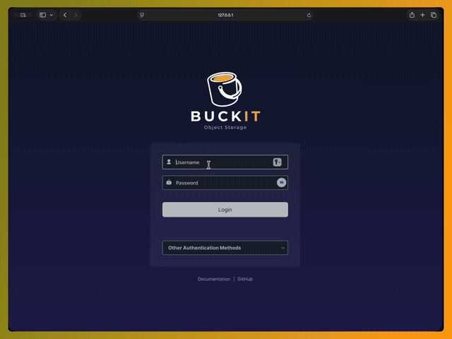

# Buckit Object Storage

<p align="center">
  <a href="https://github.com/buckit-io/buckit/actions/workflows/go-cross.yml">
    
  </a>
  <a href="https://github.com/buckit-io/buckit/actions/workflows/vulncheck.yml">
    
  </a>
  <a href="https://buckit.sh">
    
  </a>
  <a href="https://discord.gg/8BDBVDPqp">
    
  </a>
</p>

Buckit is an open-source, S3-compatible object storage system you run on your
own commodity servers. It gives your applications an Amazon S3-style API while
keeping your data under your control, and it can scale from a small setup to
hundreds of petabytes. Teams use Buckit when they want S3-like storage without
sending all data to a public cloud or paying cloud storage bills at scale.

For quick guided installation, see the [Getting Started video](https://buckit.sh/#getting-started)
or read the [documentation](https://buckit.sh/docs) to learn more.

<p align="center">
  
</p>

> [!NOTE]
> Buckit is an independent project derived from the AGPLv3-licensed
> [MinIO](https://github.com/minio/minio) project.
> Buckit is not affiliated with or endorsed by MinIO, Inc.

## What Buckit Provides

- S3-compatible object storage for existing S3 SDKs and tools.
- Standalone single-node mode for development and small deployments.
- Distributed erasure-coded mode for production clusters.
- Browser console for object and storage workflows.
- CLI tool for admin and object automation.
- Web-based cluster and node management.

## Quickstart

> [!NOTE]
> This quickstart runs Buckit manually. For a production service deployment,
> follow the [Getting Started guide](https://buckit.sh/#getting-started).

Build and run a local Buckit server:

```sh
make build
mkdir -p /tmp/buckit-data
./buckit server /tmp/buckit-data --console-address :9001
```

The S3 API listens on `http://127.0.0.1:9000`.
The console listens on `http://127.0.0.1:9001`.

Default development credentials are:

```text
Access key: buckitadmin
Secret key: buckitadmin
```

For any non-throwaway deployment, set explicit root credentials before starting
the server:

```sh
export MINIO_ROOT_USER=myadmin
export MINIO_ROOT_PASSWORD=mysecretpassword
./buckit server /data --console-address :9001
```

The root credential environment variable names remain `MINIO_ROOT_USER` and
`MINIO_ROOT_PASSWORD` for compatibility with the storage engine and existing
deployment tooling.

## Distributed Server Mode

For distributed deployments, run the same `buckit server` command on every
participating node with a shared set of drive endpoints and identical root
credentials.

Example pattern:

```sh
export MINIO_ROOT_USER=myadmin
export MINIO_ROOT_PASSWORD=mysecretpassword

buckit server \
  http://node{1...4}.example.com/data{1...4} \
  --console-address :9001
```

For new production clusters, prefer [`bm web`](https://github.com/buckit-io/buckit#buckit-manager-web) so host discovery, disk selection,
preflight checks, service setup, and generated credentials are handled by the
manager instead of hand-written shell commands.

## Install Buckit

For detailed installation instructions, see the
[Deployment Guide](https://buckit.sh/docs/operations/deployments/baremetal-deploy-server).

### Linux Packages (recommended)

Linux release packages are available as `.deb`, `.rpm`, and `.apk` artifacts.
The helper script downloads the package for the current system, verifies its
SHA-256 checksum, and prints the package-manager command to run:

```sh
curl -fsSL https://buckit-io.github.io/buckit/install-linux.sh | sh
```

### Build From Source

Buckit requires Go 1.25 or newer. If Go is not installed, download and install
it from the official Go installation page: <https://go.dev/doc/install>.

```sh
git clone https://github.com/buckit-io/buckit.git
cd buckit
make build
```

The build writes `./buckit`.

You can also install directly with Go:

```sh
go install github.com/buckit-io/buckit@latest
```

When building manually, include the `kqueue` build tag:

```sh
go build -tags kqueue -trimpath --ldflags "$(go run buildscripts/gen-ldflags.go)" -o buckit
```

## Build Docker Image

Buckit publishes container images for normal Docker usage. To build a custom
image, use the release workflow or adapt the root `Dockerfile` for your own
artifact pipeline.

Run the published image:

```sh
docker run -p 9000:9000 -p 9001:9001 \
  -v "$HOME/buckit-data:/data" \
  ghcr.io/buckit-io/buckit:latest server /data --console-address :9001
```

Run with explicit credentials:

```sh
docker run -p 9000:9000 -p 9001:9001 \
  -e MINIO_ROOT_USER=myadmin \
  -e MINIO_ROOT_PASSWORD=mysecretpassword \
  -v "$HOME/buckit-data:/data" \
  ghcr.io/buckit-io/buckit:latest server /data --console-address :9001
```

## Use Buckit With `bm`

`bm` is the Buckit Manager CLI for Buckit and S3-compatible object storage.
It provides object commands such as `ls`, `cp`, `cat`, `mirror`, and `rm`, plus
Buckit administration and cluster-management workflows.

See the [`bm` GitHub repository](https://github.com/buckit-io/bm).

Install `bm` on macOS or Linux:

```sh
curl -fsSL https://buckit-io.github.io/bm/install.sh | sh
bm --help
```

Install `bm` on Windows PowerShell:

```powershell
irm https://buckit-io.github.io/bm/install.ps1 | iex
bm --help
```

Add an alias for a local Buckit server:

```sh
bm alias set local http://localhost:9000 buckitadmin buckitadmin
bm admin info local
```

Create a bucket and copy data:

```sh
bm mb local/mydata
bm cp --recursive ./mydata/ local/mydata/
bm ls local/mydata
```

Read, mirror, and remove objects:

```sh
bm cat local/mydata/object.txt
bm mirror ./mydata local/mydata
bm rm local/mydata/object.txt
```

Use `--dry-run` before large or recursive remove operations:

```sh
bm rm --recursive --dry-run local/mydata
```

Common `bm` commands:

| Command | Purpose |
| --- | --- |
| `bm alias set` | Add or update a Buckit or S3-compatible endpoint alias. |
| `bm admin info` | Show deployment information and verify connectivity. |
| `bm ls` | List buckets, prefixes, objects, or local files. |
| `bm mb` | Create a bucket or local directory. |
| `bm cp` | Copy files or objects. |
| `bm cat` | Print file or object contents. |
| `bm mirror` | Synchronize local and object storage paths. |
| `bm rm` | Remove files or objects. |
| `bm version` | Manage bucket versioning. |
| `bm retention` | Manage object retention. |
| `bm legalhold` | Manage object legal holds. |
| `bm tag` | Manage object tags. |
| `bm ilm` | Manage lifecycle rules and tiers. |
| `bm replicate` | Manage bucket replication. |
| `bm update` | Update the `bm` binary. |

Full `bm` CLI documentation: <https://buckit.sh/docs/reference/bm-cli>

## Buckit Manager Web

`bm` also ships Buckit Manager Web, a local web UI for deploying and managing
Buckit clusters.

Start it with:

```sh
bm web
```

By default, Buckit Manager opens at `http://127.0.0.1:9443/`.

Use Buckit Manager Web to:

- Prepare a local single-node Buckit deployment on macOS or Windows.
- Deploy a managed Buckit cluster on one or more Linux servers over SSH.
- Import an existing Buckit or MinIO cluster.
- Monitor cluster health, nodes, pools, and drives.
- Run supported cluster and node operations.

Buckit Manager documentation:
<https://buckit.sh/docs/administration/buckit-manager>

## How Buckit Works Internally

- [Architecture](https://buckit.sh/docs/operations/concepts/architecture)
- [Erasure Coding](https://buckit.sh/docs/operations/concepts/erasure-coding)
- [Availability and Resiliency](https://buckit.sh/docs/operations/concepts/availability-and-resiliency)

## Development

Common repository commands:

```sh
make build
make install
make test
make lint
make verifiers
go generate ./...
make check-gen
```

Build and test commands must include the `kqueue` tag when run manually:

```sh
CGO_ENABLED=0 go test -v -tags kqueue,dev ./...
```

Generated files ending in `_gen.go` or `_string.go` must be regenerated and
committed when their source types change.

## License and Support

Buckit is licensed under the
[GNU AGPLv3](https://github.com/buckit-io/buckit/blob/master/LICENSE).

All usage must comply with AGPLv3 obligations. The license provides no warranty,
liability, or support obligation. Community support is available through GitHub
and the [Buckit Discord community](https://discord.gg/8BDBVDPqp).

See also:

- [Contributor Guide](https://github.com/buckit-io/buckit/blob/master/CONTRIBUTING.md)
- [License Compliance](https://github.com/buckit-io/buckit/blob/master/COMPLIANCE.md)
- [Buckit Manager CLI](https://github.com/buckit-io/bm)
- [Buckit Discord](https://discord.gg/8BDBVDPqp)
