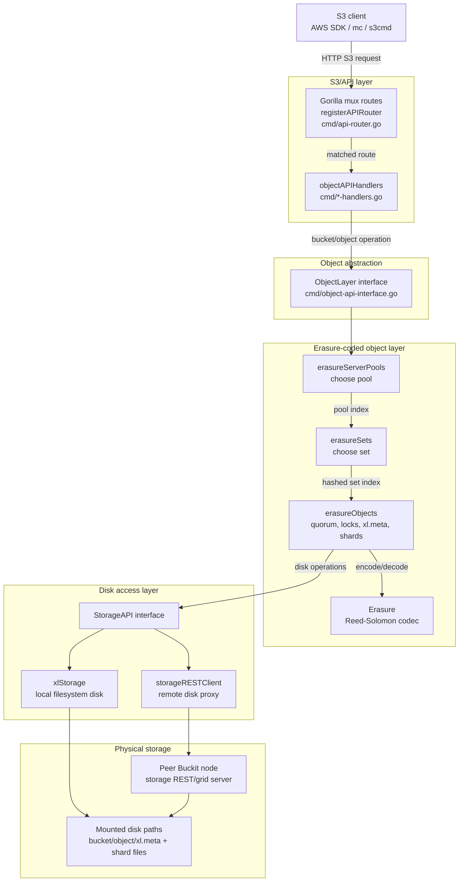
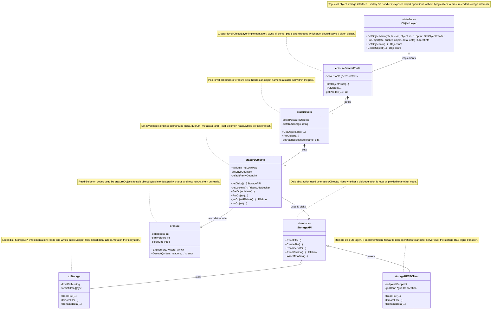
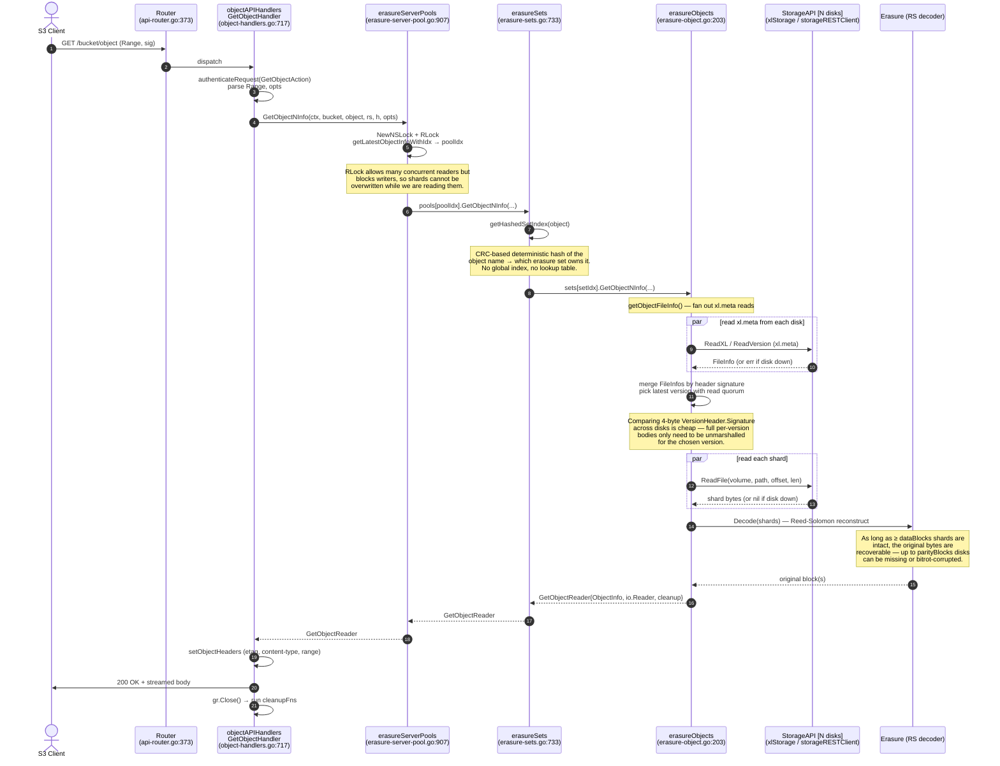
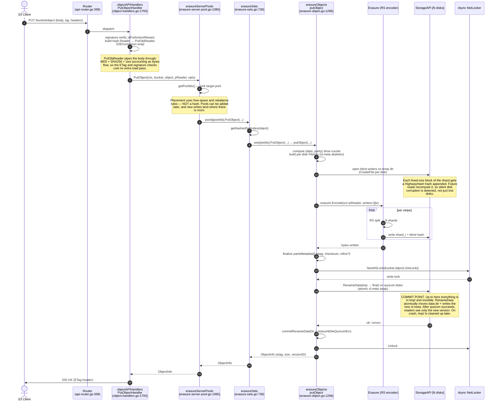
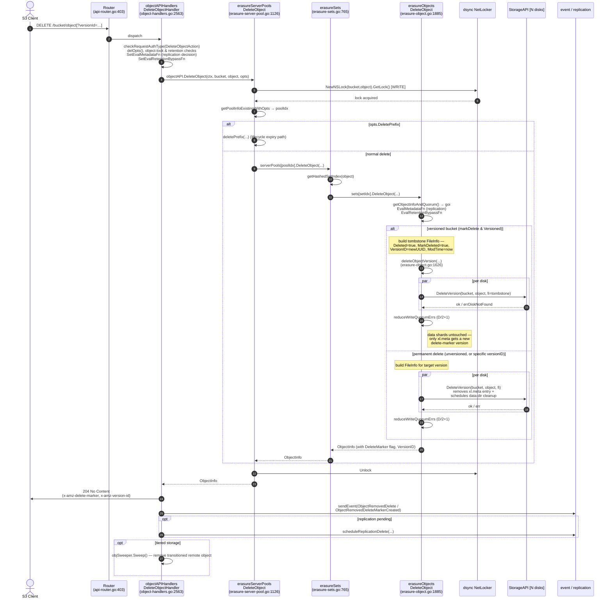
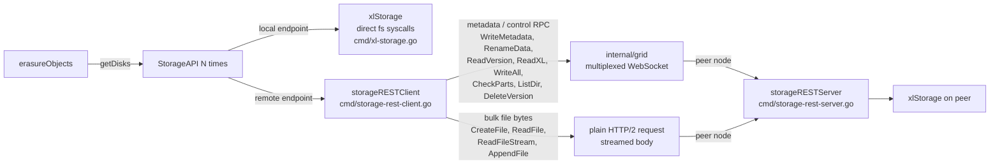
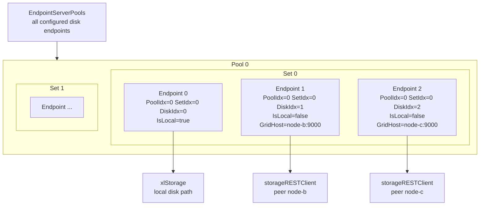
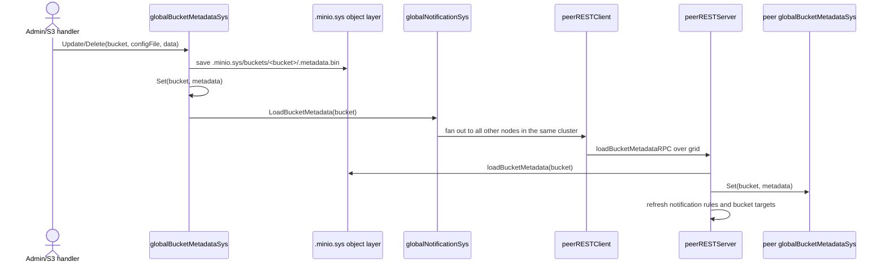

# GET / PUT Object — Request Flow


## How to read this document

Start with **Concepts** if terms like `EC:4`, `xl.meta`, shard, stripe, quorum, or `DataDir` are unfamiliar. Then read the storage layer relationship diagrams to see the major components before jumping into the detailed `xl.meta`, GET, PUT, and DELETE flows.

| If you want to understand... | Read... |
|---|---|
| The vocabulary used in every diagram | Concepts you'll see throughout |
| Which layer calls which layer | §1 Storage layer relationships |
| Which Go types represent the storage layers | §2 Class diagram |
| Which HTTP S3 routes map to which handlers | §3 S3 API routing reference |
| What is stored on disk | §4 The `xl.meta` on-disk format |
| How reads, writes, and deletes work end to end | §5 GET, §6 PUT, §7 DELETE |
| Why local and remote disks use different transports | §8 Local vs distributed disk |
| How pools, sets, disks, and peer nodes are discovered | §9 Cluster topology |
| What other metadata/configuration files exist | §10 Internal configuration files |

---

## Concepts you'll see throughout

This document leans on a handful of distributed-systems and S3 terms. If any of the diagrams or explanations feel opaque, the definitions below are the missing context.

### Storage organisation

- **Bucket** — an S3-level namespace, e.g. `s3://photos/cat.png` lives in bucket `photos`. Created and destroyed via API; not a filesystem directory.
- **Object** — one stored item: a key (the path string `cat.png`), bytes (the body), and metadata (headers like `content-type`, custom `x-amz-meta-*`).
- **Disk / drive** — one physical device or one mounted volume. To Buckit, a disk is a directory the server can read/write into.
- **Set (Erasure Set)** — a fixed-size group of disks (typically 16) that act as a single redundancy unit. Reed–Solomon encoding (below) happens *within one set* — shards never cross sets.
- **Pool** — a group of one or more Erasure sets added to the cluster as a single capacity expansion. To grow a cluster you add a new pool; existing pools stay at their original geometry.
- **Cluster** — all pools together. One Buckit deployment exposes one cluster behind an S3 endpoint.

So the hierarchy is **cluster → pools → sets → disks**, and an object lives on exactly one set within one pool.

### Deterministic object placement

**Placement** means deciding where an object belongs in the storage hierarchy: which pool, which erasure set inside that pool, and therefore which disks will hold that object's shard files. It is the routing decision before reading or writing object bytes.

Buckit does not keep a central "object key directory" that says `photos/cat.png` lives on set 7. Instead, every node can independently calculate the same placement from the object name and the cluster layout it loaded at startup. Within a pool, Buckit hashes the object key with a deterministic hash algorithm and maps the result to one erasure set. "Deterministic" means the same input key and the same cluster layout always produce the same set choice.

That design removes a central metadata service from the hot path. A GET does not first ask a directory server where the object is. For each pool, the landing node calculates the erasure set where the object would belong using the hash algorithm, then try to read that object's metadata (`xl.meta` file) from every disk in that set. If more than one pool returns valid metadata, the landing node chooses the newest valid response, and that erasure set in that pool becomes the one used to read the object bytes.

### Erasure coding (Reed–Solomon)

A way to store data redundantly that uses *less* space than full replication. The object's bytes are split into **M data shards** plus **N parity shards** computed from the data shards. Any **M out of M+N** shards are sufficient to reconstruct the original — so the storage tolerates **up to N disks failing or returning wrong bytes**.

`EC:N` is the storage-class notation for "use N parity shards." For example, `EC:4` means 4 parity shards; on a 16-drive set that leaves 12 data shards.

Example: with `EC:4` on a 16-drive set, M=12 data, N=4 parity. Storage overhead = `(M+N)/M = 16/12 ≈ 1.33×` (vs `4×` if you replicated four times for comparable durability). You can lose any 4 of 16 disks and still serve reads.

Simplified `EC:2` example with 6 disks: `M=4` data disks and `N=2` parity disks.

```text
Original object bytes
        │
        ▼
Split into rows of 4 data blocks, then add 2 parity blocks per row.
Each column is one shard written to one disk.

                 Disk 1   Disk 2   Disk 3   Disk 4   Disk 5   Disk 6
                 Shard 1  Shard 2  Shard 3  Shard 4  Shard 5  Shard 6
                (part.1) (part.1) (part.1) (part.1) (part.1) (part.1)
               ┌────────┬────────┬────────┬────────┬────────┬────────┐
Stripe 1  ───▶ │block A │block B │block C │block D │parity A│parity B│
               ├────────┼────────┼────────┼────────┼────────┼────────┤
Stripe 2  ───▶ │block E │block F │block G │block H │parity C│parity D│
               ├────────┼────────┼────────┼────────┼────────┼────────┤
Stripe 3  ───▶ │block I │block J │block K │block L │parity E│parity F│
               └────────┴────────┴────────┴────────┴────────┴────────┘

One stripe = one row across all disks.
One block  = one cell in that row.
One shard  = one full column of blocks, stored on one disk.

In this 3-row example there are 6 shards total and 18 blocks total.
```

- **Shard** — the shard is the file written on one disk for one object part. In the diagram, each column is one shard, and each shard is stored as that disk's `part.1` file. With 6 disks there are 6 `part.1` files for the same object part — one per disk. For multipart uploads, the next object part is stored as `part.2`, then `part.3`, and so on.
- **Stripe** — one row in the diagram. During PUT, Buckit reads the object body (from upload) one stripe (4 data blocks in the example) at a time: take all data blocks (4 in the example), calculate the parity blocks (2 in the example) for that group, then append the data and parity blocks to each of the shard files (4 `part.1`) on different disks (6).
- **Block** — one fixed-size cell inside a stripe/shard (usually 1 MiB in size). Each block has its own bitrot hash (below) so corruption can be detected at block granularity.

### Quorum

The minimum number of disks that must agree (for reads) or successfully accept (for writes) before an operation is considered to have happened. The point is to survive failures *and* avoid split-brain when a network partition isolates a minority of disks.

In a set of `D = M+N` disks:

- **Read quorum** — for a normal object, usually `M` (`dataBlocks`). Enough shards must be available to reconstruct the object bytes.
- **Write quorum** — usually `M`; when `M == N` it is raised to `M + 1` to avoid split-brain between two equal halves of the set.
- **Delete quorum** — `D/2 + 1` (a simple majority). Looser than read/write quorum because a tombstone is just a small metadata flag — being strict here would unnecessarily fail deletes on degraded clusters.

When you see "reads `xl.meta` from quorum disks" in the diagrams, it does not mean "read only `D/2+1` disks." The code fans out `xl.meta` reads to every disk in the set, then accepts metadata only when enough disks agree for that object's quorum. For a normal object that quorum is based on `M` data blocks; for delete-marker style metadata, simple majority (`D/2+1`) is enough.

Quick reference:

| Operation | Quorum used | Why |
|---|---|---|
| GET | Read quorum, usually `M` | Enough disks must agree on `xl.meta`, then enough shards must be readable to reconstruct bytes. |
| PUT | Write quorum, usually `M`; `M+1` when `M == N` | The new `xl.meta` and shard `DataDir` must commit on enough disks before the write is visible. |
| DELETE | Majority, `D/2 + 1` | Deletes are metadata updates; requiring full write quorum would make deletes fail unnecessarily on degraded clusters. |

### Bitrot / silent corruption

A disk that returns *wrong bytes* without reporting an error — e.g. a flipped bit from a firmware bug, cosmic ray, faulty cable, or aging media. The OS and disk think nothing is wrong; only a checksum can detect it.

Buckit protects against bitrot by appending a small hash to each fixed-size block when writing the shard, and recomputing+verifying it on read. If the hash mismatches, that block is treated as failed and Reed–Solomon reconstructs it from parity. The hash function used is **HighwayHash** (fast on modern CPUs because it uses SIMD instructions).

### Distributed lock (`dsync` / `NSLock`)

When multiple Buckit nodes can each handle requests for the same object, an in-process lock isn't enough — node A could be writing while node B reads. **`dsync`** is Buckit's distributed lock library; it runs a quorum-based protocol across the cluster nodes so that "I hold the write lock for `bucket/object`" is true cluster-wide, not just on one node. **`NSLock`** ("namespace lock") is the wrapper used in the storage layer that takes a `(bucket, object)` pair and gives you `RLock`/`Lock` methods backed by `dsync`.

### MessagePack ("msgpack")

The on-disk format Buckit uses for `xl.meta` and for many of its inter-node RPC payloads. It's a **language-neutral binary serialisation format** — like JSON but binary, with a 1-byte type tag in front of every value. Not a Go thing; libraries exist in essentially every language. Smaller than JSON, faster to parse, no separate schema file required (unlike Protobuf). See §4 for the full layout of `xl.meta`.

### Hash functions you'll see (and why each one)

- **MD5** — used as the S3 **ETag** for non-multipart objects. *Not* used for security; it's just the value AWS S3 contractually returns.
- **SHA256** — used in **SigV4**, the AWS signature scheme. The client signs the request with HMAC-SHA256; the server recomputes and compares to authenticate.
- **HighwayHash** — used for per-block bitrot detection inside shard files. Cryptographically not strong, but very fast.
- **xxhash** — used for the `xl.meta` trailer CRC. Even faster than HighwayHash; not collision-resistant in a security sense, but more than enough to detect file corruption.
- **CRC32C** — optional, for the AWS `x-amz-checksum-crc32c` header. Stored in `MetaSys["x-minio-internal-crc"]`.

These are *integrity* hashes (detect corruption) except SHA256-in-SigV4, which is *authentication* (detect tampering by an attacker).

### S3 / API terms

- **ETag** — the S3 identifier for an object's bytes; for single-part objects it's `md5(body)`. Returned on PUT, used by clients for cache validation and conditional requests.
- **SigV4** — AWS Signature Version 4, the request-signing scheme S3 uses (`Authorization: AWS4-HMAC-SHA256 …` header).
- **SSE-S3 / SSE-KMS / SSE-C** — server-side encryption modes. SSE-S3 uses server-managed keys, SSE-KMS uses an external KMS, SSE-C uses keys the client provides per request.
- **Single-part PUT** — the normal `PUT /bucket/object` request where the client sends the whole object body in one request. On disk, that object part is stored as one shard file named `part.1` on each disk.
- **Multipart upload** — uploading a large object as N numbered parts via separate `UploadPart` calls, then a final `CompleteMultipartUpload`. On disk, each uploaded part gets its own shard file name on every disk: `part.1`, `part.2`, `part.3`, and so on. Each part has its own ETag; the object's final ETag is `md5(concat-of-part-md5s) + "-N"`.
- **Versioned bucket** — a bucket where overwriting or deleting an object preserves the prior version, identified by a UUID. A "DELETE" without a version ID adds a *delete marker* (see next entry) instead of removing data. Default GETs hide everything below a delete marker; explicit `?versionId=…` GETs still work.
- **DeleteMarker** — a tombstone entry in a versioned bucket's version chain. When you `DELETE` an object on a versioned bucket without specifying a version, Buckit **does not erase the bytes** — it prepends a small "this object was deleted" record to the version chain in `xl.meta`. The record has its own UUID and timestamp, but **no `DataDir`, no shards, no parts** — it is purely metadata. Effects: a default `GET` returns 404 (the marker is the newest version); `GET ?versionId=<original-id>` still succeeds and reads the original bytes; `ListObjectsV2` hides the object but `ListObjectVersions` shows both entries. To actually erase the bytes you must do a *permanent* delete with `DELETE ?versionId=<original-id>`. Used so deletes on versioned buckets are cheap (no shard rewrite, see §7), reversible (remove the marker → object reappears), and audit-friendly (every deletion is a recorded versioned event). On disk it looks like `xlMetaV2DeleteMarker{VersionID, ModTime, MetaSys}` — see §4.4 and the two-version sample in §4.9.
- **Object lock / WORM** — Write-Once-Read-Many retention. An object under a lock cannot be deleted or overwritten until its retention end date — used for compliance (SEC 17a-4, GDPR retention, etc.).
- **Lifecycle / ILM** — bucket-level rules that automatically transition (move to cheaper tier) or expire (delete) objects after a period.
- **Replication** — copying writes to a peer S3 cluster asynchronously. The source records pending status in `xl.meta`; a background worker pushes to the target.

### Networking terms

- **Multiplexed WebSocket** — many independent logical streams sharing one underlying TCP+WebSocket connection. Each frame is tagged with a stream ID so concurrent calls don't have to open N sockets. Buckit's `internal/grid` is built this way.
- **Head-of-line blocking** — when one slow message on a multiplexed connection delays every other message behind it (the head-of-line message is "blocking the line"). Streaming a 100 MB shard over the same WebSocket as a 50-byte metadata RPC would block the metadata call for seconds. That is exactly why Buckit routes shard bytes over plain HTTP and only metadata over the grid WebSocket — see §8.

---

## 1. Storage layer relationships

In this document, a **layer** is a way to group related code by what it does. It is a mental model, not something that necessarily exists as a separate process, service, or runtime object. Buckit is a complex system, so we organize its components into a hierarchy: the S3/API layer deals with HTTP and S3 rules, the object layer exposes object operations, the pool/set layers decide where an object belongs, and the disk layer performs local or remote disk I/O.

**Layer-by-layer responsibility**

| Layer | Class | File | Role |
|---|---|---|---|
| S3/API layer | `objectAPIHandlers` | `cmd/object-handlers.go` | HTTP request handling: auth, headers, ranges, and S3 response framing. Not shown in the diagram, but it calls into `ObjectLayer`. |
| Object abstraction | `ObjectLayer` | `cmd/object-api-interface.go` | Defines the object operations used by S3/API code, such as `GetObjectNInfo`, `PutObject`, and `DeleteObject`. The concrete implementation is usually `erasureServerPools`. |
| Cluster / pool routing | `erasureServerPools` | `cmd/erasure-server-pool.go` | Top-level implementation of `ObjectLayer`; chooses which pool owns the object. |
| Pool / set routing | `erasureSets` | `cmd/erasure-sets.go` | Chooses which erasure set inside a pool owns the object. |
| Erasure set engine | `erasureObjects` | `cmd/erasure.go`, `cmd/erasure-object.go` | Coordinates quorum, locking, metadata, encoding/decoding, and disk operations for one set. |
| Disk abstraction | `StorageAPI` | `cmd/storage-interface.go` | Interface for one disk endpoint, hiding local vs remote access. |
| Local disk | `xlStorage` | `cmd/xl-storage.go` | Concrete `StorageAPI` for a disk mounted on the current node. |
| Remote disk | `storageRESTClient` | `cmd/storage-rest-client.go` | Concrete `StorageAPI` proxy for a disk attached to another node. |
| Erasure coding helper | `Erasure` | `cmd/erasure-coding.go` | Codec used by `erasureObjects` to split object bytes into data/parity shards and reconstruct them on reads. |

**Component view — how the layers fit together**



## 2. Class diagram — the storage layer hierarchy



## 3. S3 API routing reference

**Major S3 APIs and classes**

The external S3 API is registered in `cmd/api-router.go` and implemented as methods on `objectAPIHandlers`. Those handlers then call the storage-facing `ObjectLayer` interface, whose erasure-coded implementation is `erasureServerPools -> erasureSets -> erasureObjects`.

| S3 API | Route shape | Handler class / method | File | Storage class / method |
|---|---|---|---|---|
| ListBuckets | `GET /` | `objectAPIHandlers.ListBucketsHandler` | `cmd/bucket-handlers.go` | `ObjectLayer.ListBuckets` |
| CreateBucket | `PUT /{bucket}` | `objectAPIHandlers.PutBucketHandler` | `cmd/bucket-handlers.go` | `ObjectLayer.MakeBucket` |
| HeadBucket | `HEAD /{bucket}` | `objectAPIHandlers.HeadBucketHandler` | `cmd/bucket-handlers.go` | `ObjectLayer.GetBucketInfo` |
| DeleteBucket | `DELETE /{bucket}` | `objectAPIHandlers.DeleteBucketHandler` | `cmd/bucket-handlers.go` | `ObjectLayer.DeleteBucket` |
| GetBucketLocation | `GET /{bucket}?location` | `objectAPIHandlers.GetBucketLocationHandler` | `cmd/bucket-handlers.go` | Bucket metadata/config lookup |
| ListObjectsV1 | `GET /{bucket}` | `objectAPIHandlers.ListObjectsV1Handler` | `cmd/bucket-listobjects-handlers.go` | `ObjectLayer.ListObjects` |
| ListObjectsV2 | `GET /{bucket}?list-type=2` | `objectAPIHandlers.ListObjectsV2Handler` | `cmd/bucket-listobjects-handlers.go` | `ObjectLayer.ListObjectsV2` |
| ListObjectVersions | `GET /{bucket}?versions` | `objectAPIHandlers.ListObjectVersionsHandler` | `cmd/bucket-listobjects-handlers.go` | `ObjectLayer.ListObjectVersions` |
| GetObject | `GET /{bucket}/{object}` | `objectAPIHandlers.GetObjectHandler` | `cmd/object-handlers.go` | `ObjectLayer.GetObjectNInfo` |
| HeadObject | `HEAD /{bucket}/{object}` | `objectAPIHandlers.HeadObjectHandler` | `cmd/object-handlers.go` | `ObjectLayer.GetObjectInfo` |
| PutObject | `PUT /{bucket}/{object}` | `objectAPIHandlers.PutObjectHandler` | `cmd/object-handlers.go` | `ObjectLayer.PutObject` |
| CopyObject | `PUT /{bucket}/{object}` + `x-amz-copy-source` | `objectAPIHandlers.CopyObjectHandler` | `cmd/object-handlers.go` | `ObjectLayer.CopyObject` |
| DeleteObject | `DELETE /{bucket}/{object}` | `objectAPIHandlers.DeleteObjectHandler` | `cmd/object-handlers.go` | `ObjectLayer.DeleteObject` |
| DeleteObjects | `POST /{bucket}?delete` | `objectAPIHandlers.DeleteMultipleObjectsHandler` | `cmd/bucket-handlers.go` | `ObjectLayer.DeleteObjects` |
| CreateMultipartUpload | `POST /{bucket}/{object}?uploads` | `objectAPIHandlers.NewMultipartUploadHandler` | `cmd/object-multipart-handlers.go` | `ObjectLayer.NewMultipartUpload` |
| UploadPart | `PUT /{bucket}/{object}?partNumber&uploadId` | `objectAPIHandlers.PutObjectPartHandler` | `cmd/object-multipart-handlers.go` | `ObjectLayer.PutObjectPart` |
| UploadPartCopy | `PUT /{bucket}/{object}?partNumber&uploadId` + `x-amz-copy-source` | `objectAPIHandlers.CopyObjectPartHandler` | `cmd/object-multipart-handlers.go` | `ObjectLayer.CopyObjectPart` |
| ListParts | `GET /{bucket}/{object}?uploadId` | `objectAPIHandlers.ListObjectPartsHandler` | `cmd/object-multipart-handlers.go` | `ObjectLayer.ListObjectParts` |
| CompleteMultipartUpload | `POST /{bucket}/{object}?uploadId` | `objectAPIHandlers.CompleteMultipartUploadHandler` | `cmd/object-multipart-handlers.go` | `ObjectLayer.CompleteMultipartUpload` |
| AbortMultipartUpload | `DELETE /{bucket}/{object}?uploadId` | `objectAPIHandlers.AbortMultipartUploadHandler` | `cmd/object-multipart-handlers.go` | `ObjectLayer.AbortMultipartUpload` |
| ListMultipartUploads | `GET /{bucket}?uploads` | `objectAPIHandlers.ListMultipartUploadsHandler` | `cmd/bucket-handlers.go` | `ObjectLayer.ListMultipartUploads` |
| GetObjectTagging | `GET /{bucket}/{object}?tagging` | `objectAPIHandlers.GetObjectTaggingHandler` | `cmd/object-handlers.go` | `ObjectLayer.GetObjectTags` |
| PutObjectTagging | `PUT /{bucket}/{object}?tagging` | `objectAPIHandlers.PutObjectTaggingHandler` | `cmd/object-handlers.go` | `ObjectLayer.PutObjectTags` |
| DeleteObjectTagging | `DELETE /{bucket}/{object}?tagging` | `objectAPIHandlers.DeleteObjectTaggingHandler` | `cmd/object-handlers.go` | `ObjectLayer.DeleteObjectTags` |
| GetBucketPolicy | `GET /{bucket}?policy` | `objectAPIHandlers.GetBucketPolicyHandler` | `cmd/bucket-policy-handlers.go` | Bucket policy subsystem |
| PutBucketPolicy | `PUT /{bucket}?policy` | `objectAPIHandlers.PutBucketPolicyHandler` | `cmd/bucket-policy-handlers.go` | Bucket policy subsystem |
| DeleteBucketPolicy | `DELETE /{bucket}?policy` | `objectAPIHandlers.DeleteBucketPolicyHandler` | `cmd/bucket-policy-handlers.go` | Bucket policy subsystem |
| GetBucketLifecycle | `GET /{bucket}?lifecycle` | `objectAPIHandlers.GetBucketLifecycleHandler` | `cmd/bucket-lifecycle-handlers.go` | Bucket lifecycle subsystem |
| PutBucketLifecycle | `PUT /{bucket}?lifecycle` | `objectAPIHandlers.PutBucketLifecycleHandler` | `cmd/bucket-lifecycle-handlers.go` | Bucket lifecycle subsystem |
| DeleteBucketLifecycle | `DELETE /{bucket}?lifecycle` | `objectAPIHandlers.DeleteBucketLifecycleHandler` | `cmd/bucket-lifecycle-handlers.go` | Bucket lifecycle subsystem |
| GetBucketVersioning | `GET /{bucket}?versioning` | `objectAPIHandlers.GetBucketVersioningHandler` | `cmd/bucket-versioning-handler.go` | Bucket versioning subsystem |
| PutBucketVersioning | `PUT /{bucket}?versioning` | `objectAPIHandlers.PutBucketVersioningHandler` | `cmd/bucket-versioning-handler.go` | Bucket versioning subsystem |
| SelectObjectContent | `POST /{bucket}/{object}?select&select-type=2` | `objectAPIHandlers.SelectObjectContentHandler` | `cmd/object-handlers.go` | `ObjectLayer.GetObjectNInfo` plus S3 Select engine |

---

## 4. The `xl.meta` on-disk format

`xl.meta` is the per-object metadata file that lives next to the object's shard data on every disk in an erasure set. Every GET reads it (to discover layout and pick a version); every PUT writes a new one (atomically, via `RenameData`); every DELETE either rewrites it with a new tombstone version or strips a version out of it. Understanding its layout demystifies whole system.

Authoritative source: `cmd/xl-storage-format-v2.go`, `cmd/xl-storage-meta-inline.go`.

> **Note on MessagePack.** Throughout this section "msgpack" refers to **[MessagePack](https://msgpack.org)** — a *language-neutral* binary serialisation format ("JSON but binary"). It is not Go-specific; there are mature libraries in C, C++, Rust, Python, JS, Java, Ruby, etc. Each value starts with a 1-byte type tag (e.g. `0xc6` = `bin32`, `0xce` = `uint32`, `0x82` = a 2-entry map), so a reader decodes without needing a schema. Buckit uses the [`tinylib/msgp`](https://github.com/tinylib/msgp) Go library, which generates `MarshalMsg`/`UnmarshalMsg` methods at build time — that is why files ending in `_gen.go` exist in the repo (see CLAUDE.md → *Code Generation*). Picking msgpack over JSON gives smaller files and faster parsing; picking it over Protobuf avoids a separate schema-compilation step. Practical consequence: scripts in Python, Rust, etc. can decode the MessagePack parts using off-the-shelf libraries, but they must first handle Buckit's `xl.meta` file envelope described below.

### 4.1 On-disk byte layout

`xl.meta` is **not just one MessagePack value from byte 0**. The file starts with Buckit's own 8-byte header:

```text
58 4c 32 20  01 00 03 00
└── "XL2 "   └─ major=1, minor=3
```

Only after that header does the MessagePack framing begin. The MessagePack part starts at the `0xc6` `bin32` wrapper around the metadata payload.

```
┌──────────────────────────────────────────────────────────────────┐
│ 'X' 'L' '2' ' '         (4 bytes)  magic — xlHeader              │
│ major (uint16 LE)       (2 bytes)                                │ ← framing
│ minor (uint16 LE)       (2 bytes)  current version is 1.3        │
├──────────────────────────────────────────────────────────────────┤
│ 0xc6 + uint32 size      (5 bytes)  msgpack bin32 wrapper around  │
│                                    the metadata payload          │
├──────────────────────────────────────────────────────────────────┤
│ headerVersion (uint8)                                            │
│ metaVersion   (uint8)                                            │
│ versionsCount (int)                                              │
│                                                                  │ ← metadata
│ For each version (newest first):                                 │   payload
│   ┌── xlMetaV2VersionHeader (msgpack)  — small, indexable        │
│   └── xlMetaV2Version body (msgpack)   — full per-version blob   │
├──────────────────────────────────────────────────────────────────┤
│ 0xce + uint32 BE        (5 bytes)  trailer CRC                   │
│                                    xxhash64(metadata) → low32    │ ← integrity
├──────────────────────────────────────────────────────────────────┤
│ inline data (optional, variable)   small object bodies, keyed    │ ← inline
│                                    by VersionID (see §4.5)       │   data
└──────────────────────────────────────────────────────────────────┘
```

Key design choices:

- **Magic + version prefix** lets the loader detect legacy `xl.json` (v1) files and dispatch to a converter.
- **Each version stored twice** — once as a slim header, once as the full body. Listing & quorum-merge code only needs the header, so it can skip-scan thousands of versions without unmarshalling the heavy parts.
- **Trailer CRC** uses xxhash truncated to 32 bits and covers only the metadata, not the inline data trailer (inline data has its own per-block bitrot hashes).
- **Append-only structure within a single write** — but the file itself is replaced wholesale by `RenameData`, never edited in place.

**What "msgpack bin32 wrapper" means.** MessagePack — the binary serialisation format Buckit uses for the metadata payload — has three type tags for raw binary blobs depending on length: `bin8` (≤255 B, tag `0xc4`), `bin16` (≤64 KiB, tag `0xc5`) and `bin32` (≤4 GiB, tag `0xc6`). Each tag is followed by the length, then the bytes. `xl.meta` always uses the `bin32` form for the whole metadata payload:

```
c6  00 00 02 b4   <… 692 bytes of metadata: headerVersion, metaVersion, versions[] …>
└┬┘ └────┬─────┘
 │       └── uint32 big-endian length = 0x2b4 = 692
 └────────── 0xc6 = msgpack "bin32" type marker
```

The wrapper exists because the file is not a single msgpack value — it is `[XL2 magic][version][bin32-of-metadata][trailer CRC][optional inline data]`. Wrapping the metadata as `bin32` gives loaders two useful properties:

1. **A standard msgpack reader can scan the file in one pass.** It sees the `bin32` tag, jumps the declared length, and lands cleanly on the trailer CRC. No knowledge of the inner version-list layout is required.
2. **The length is known up front**, so loaders can read the metadata into one slab (or `mmap` it) without parsing first — that is what the listing fast-path uses to touch only `Header`s without unmarshalling the heavy bodies.

`bin32` is used (rather than `bin16`) because a heavily versioned object's metadata can exceed 64 KiB in principle; the variants only differ by 2 bytes of overhead, so there is no reason to ever pick the smaller one. The trailer CRC at the end uses the analogous `0xce` tag — msgpack's `uint32` marker — for the same kind of self-describing framing.

References: `xlHeader` and version constants `cmd/xl-storage-format-v2.go:44, 69-70`; framing in `xlMetaV2.AppendTo` `:1194-1230`; CRC validation `:877-882`.

### 4.2 Top-level struct

```go
// cmd/xl-storage-format-v2.go:901
type xlMetaV2 struct {
    versions []xlMetaV2ShallowVersion // sorted by ModTime DESC; index 0 = latest
    data     xlMetaInlineData         // optional inline bodies (see §4.5)
    metaV    uint8                    // metadata schema version
}
```

It is essentially a **journal of versions**, newest first. Every PUT prepends; every DELETE either prepends a tombstone or removes one entry. Versioning-disabled buckets hold exactly one version.

### 4.3 `xlMetaV2VersionHeader` — the slim header that makes listing fast

#### What problem are we solving?

A heavily versioned object can have hundreds of versions in its chain. Each version's full body — parts list, erasure layout, two metadata maps — runs from ~100 bytes up to several KiB.

But many hot operations don't need any of those details. In particular:

- **Listing** (`ListObjectsV2`, `ListObjectVersions`) only needs the version's UUID, timestamp, and whether it's a delete marker.
- **Quorum-merging** — when a GET reads `xl.meta` from `N` disks and has to decide which version is "the latest that a majority of disks agree on" — needs a way to compare the same version across disks *without* unmarshalling and diffing the full bodies.
- **Picking the latest live version** (skip delete markers, find the newest object) only needs `Type` and `ModTime`.

If those operations had to unmarshal every full version body, listing a bucket with millions of versioned objects would crawl, and quorum-merge would be unacceptably slow on large sets.

#### The solution

Store every version **twice** in `xl.meta`: once as a slim, fixed-shape *header* containing only the indexable fields, then immediately followed by the full *body*. Code that only needs the cheap fields skim-scans the headers. The expensive body is unmarshalled lazily — typically only for the one version actually selected.

```go
// cmd/xl-storage-format-v2.go:249
type xlMetaV2VersionHeader struct {
    VersionID [16]byte    // UUID of the version
    ModTime   int64       // unix nanos
    Signature [4]byte     // deterministic content digest — for cross-disk merge
    Type      VersionType // 1 = Object, 2 = DeleteMarker, 3 = Legacy(v1)
    Flags     xlFlags     // FreeVersion | UsesDataDir | InlineData
    EcN, EcM  uint8       // erasure (parity, data) — 0/0 for legacy/delete-marker
}
```

The clever field is **`Signature`** — a 4-byte deterministic digest of the version's metadata and erasure parameters. Two disks that hold *the same content* for *the same version* will produce the same `Signature`. So when quorum-merge code reads `xl.meta` from N disks and asks "do these copies of version `X` actually represent the same content?", it compares 4-byte signatures instead of marshalled blobs. See `mergeXLV2Versions(...)` for the merge logic.

### 4.4 The version body — `xlMetaV2Version` and its three shapes

#### What problem are we solving?

A "version" in the chain is not always the same kind of thing. Three distinct shapes need to coexist in one chain:

- A **live object version** — has shards on disk, an ETag, content-type, parts list, erasure parameters, two metadata maps. The rich case.
- A **delete-marker tombstone** — has only an ID, a timestamp, and a little replication bookkeeping. No data, no shards, no parts.
- A **legacy v1 object** — pre-v2 format, kept around so already-stored objects don't need an offline migration. Read-only — never produced by new writes, only converted on access.

The format needs a single "version" type that can hold *any one* of these, so the chain can be a uniform array.

#### The solution

A wrapper struct with one optional pointer for each shape; the `Type` field says which one is filled.

```go
// cmd/xl-storage-format-v2.go:181
type xlMetaV2Version struct {
    Type             VersionType
    ObjectV1         *xlMetaV1Object       // set when Type == LegacyV1
    ObjectV2         *xlMetaV2Object       // set when Type == Object   (the common case)
    DeleteMarker     *xlMetaV2DeleteMarker // set when Type == DeleteMarker
    WrittenByVersion uint64                // Buckit build that wrote this version (forensics)
}
```

`Type` here is the same value as the `Type` in the slim header (§4.3) — they always agree, which is what lets the slim header decide which body shape to expect without reading the body.

The next two subsections list the fields of the two interesting shapes (`xlMetaV2Object` and `xlMetaV2DeleteMarker`); the legacy `xlMetaV1Object` is omitted because new code should never produce it.

#### `xlMetaV2Object` — a live object version (`cmd/xl-storage-format-v2.go:156`)

| Field | Meaning |
|---|---|
| `VersionID [16]byte` | UUID of this version (matches the header) |
| `DataDir [16]byte` | UUID of the directory under the object that holds *this* version's shard data — see §4.6 |
| `ErasureAlgorithm` | `ReedSolomon` (1) |
| `ErasureM`, `ErasureN` | data / parity block counts (e.g. 12 / 4 for `EC:4` on a 16-drive set) |
| `ErasureBlockSize` | bytes per block before encoding (default 1 MiB) |
| `ErasureIndex` | which shard index *this disk* holds, 0 … M+N-1 |
| `ErasureDist []uint8` | the permutation mapping shard indices to disks (cluster-wide) |
| `BitrotChecksumAlgo` | `HighwayHash` (1) |
| `PartNumbers []int`<br/>`PartSizes []int64`<br/>`PartETags []string`<br/>`PartActualSizes []int64`<br/>`PartIndices [][]byte` | per-part metadata for multipart uploads; single-part PUT has length-1 slices |
| `Size int64`, `ModTime int64` | object size before encoding, modification time |
| `MetaSys map[string][]byte` | system metadata, see §4.7 |
| `MetaUser map[string]string` | user-provided `x-amz-meta-*` headers |

**`xlMetaV2DeleteMarker`** — the tombstone case (`cmd/xl-storage-format-v2.go:144`):

| Field | Meaning |
|---|---|
| `VersionID [16]byte` | new UUID assigned when the marker was created |
| `ModTime int64` | when the delete happened |
| `MetaSys map[string][]byte` | replication-state, free-version tracking, governance bypass info |

A delete marker has **no `DataDir`, no erasure info, no parts** — that is precisely why "delete on a versioned bucket touches no shards", as called out in §7.

### 4.5 Inline data — when small objects skip the part file

#### What problem are we solving?

The normal storage path for an object is **two files per disk**: a small `xl.meta` plus a separate `part.1` containing the shard bytes. That's fine for a 100 MiB object — the metadata file is dwarfed by the data file.

For *tiny* objects (a 200-byte JSON config, a 1 KiB thumbnail, an empty marker file), the same path is wasteful:

- **Two disk operations per disk** — open + read `xl.meta`, then open + read `part.1` — when the actual payload is smaller than a single disk sector. The fixed cost dominates.
- **Filesystem clutter.** A bucket with millions of small objects ends up with millions of tiny `part.1` files. Inode-heavy operations (`ls`, the background scanner, fsck) get expensive, and small-file allocations waste FS block space.

#### The solution

Below a small-size threshold, **store the body bytes inside `xl.meta` itself**, as a trailer right after the metadata payload (see the byte-layout diagram in §4.1). No separate `part.1` is created.

```go
// cmd/xl-storage-meta-inline.go:29
type xlMetaInlineData []byte
// On the wire:  [version byte] [msgpack map keyed by VersionID → body bytes]
```

The map is keyed by `VersionID` so an `xl.meta` with multiple versions can carry one inline body per version. The version's `Header.Flags` field carries an `InlineData` bit that tells readers "this version's body is in the inline trailer, don't go looking for `part.1`" — and a matching marker `x-minio-internal-inline-data` is set in `MetaSys` for the same purpose.

#### Trade-offs

- **Pro:** A GET of a tiny object is *one* disk read, not two. Latency drops sharply for small-object-heavy workloads.
- **Pro:** No `part.1` clutter; the filesystem holds only `xl.meta`. Scanner and listing paths get faster.
- **Con:** `xl.meta` grows with the body, so any code path that reads `xl.meta` (listing, quorum-merge) now reads more bytes per object. That's why the threshold is small — beyond it, the listing cost outweighs the read-saving.

References: `xl-storage-format-v2.go:533, 1698-1700`.

### 4.6 `DataDir` — finding a version's shard files on disk

#### What problem are we solving?

A single object (e.g. `bucket/photo.jpg`) can have many versions over its lifetime. Each version's bytes are split into **shards** that get written as files on disk. Where on disk should those shard files live?

A naive layout — always at `bucket/photo.jpg/part.1` — breaks immediately:

- An overwrite would have to overwrite `part.1`, racing any concurrent reader who is still in the middle of streaming it.
- Versioning becomes impossible — there's only one filename per object, no place to keep older versions.

Numbering by version (`part.1.v1`, `part.1.v2`, …) doesn't fix it either: parallel PUTs would race over "which number is next," and crashed PUTs would leave files that look real but aren't referenced.

#### The solution

Each version gets its own **subdirectory**, named by a fresh UUID generated at PUT time. That UUID is stored in the version's `xl.meta` entry as the `DataDir` field. The version's shard files (`part.1`, `part.2`, … for multipart) live underneath. Different versions never share a directory; their shards never collide.

```
disk1/bucket/photo.jpg/                       ← the object's directory on this disk
├── a192c1d5-9bd5-41fd-9a90-ab10e165398d/    ← version A's DataDir (UUID)
│   └── part.1                                ← version A's shard for this disk
├── c06e0436-f813-447e-ae5e-f2564df9dfd4/    ← version B's DataDir (a later overwrite)
│   └── part.1                                ← version B's shard
├── legacy/                                   ← pre-v2 layout, if this object was migrated
│   └── part.1
└── xl.meta                                   ← chain of versions A, B, legacy (newest first)
```

`xl.meta` is the index that ties everything together: each version entry inside it carries the `DataDir` UUID that points to the matching subdirectory.

Across the erasure set, each disk has the same bucket/object path and the same shard filename (`part.1` for a single-part object), but each `part.1` file contains that disk's shard:

```text
disk1/
└── photos/cat.jpg/
    ├── xl.meta
    └── a192c1d5-9bd5-41fd-9a90-ab10e165398d/
        └── part.1        ← shard 1

disk2/
└── photos/cat.jpg/
    ├── xl.meta
    └── a192c1d5-9bd5-41fd-9a90-ab10e165398d/
        └── part.1        ← shard 2

...

disk16/
└── photos/cat.jpg/
    ├── xl.meta
    └── a192c1d5-9bd5-41fd-9a90-ab10e165398d/
        └── part.1        ← shard 16
```

For multipart objects, each disk stores one shard file per uploaded part: `part.1`, `part.2`, `part.3`, and so on, under the same version `DataDir`.

#### Why this layout works well

- **Overwrites don't touch existing data.** A new PUT writes its shards into a fresh UUID subdirectory while the old version's directory is untouched. Only the final atomic `xl.meta` replacement makes the new version visible. Any in-flight GET holding a read lock on the old version keeps reading the old shards correctly (see §5 step 5).
- **Crashed PUTs are easy to clean up.** A failed PUT leaves an orphan UUID directory that no `xl.meta` references. The background **scanner** walks each object's directory, lists the UUID subdirectories on disk, cross-checks them against `xl.meta`, and removes anything unreferenced.
- **DELETE is cheap and reversible.** A permanent delete just removes the version's entry from `xl.meta` and renames the matching `DataDir` into a `.trash`-style location for async reclamation. A versioned-bucket delete doesn't touch the `DataDir` at all — it only prepends a tombstone, so the original version's directory remains reachable via `?versionId=`.

Reference: `xl-storage-format-v2.go:158, 682`; on-disk layout doc-comment `:90-102`.

### 4.7 Two metadata maps: `MetaSys` and `MetaUser`

#### What problem are we solving?

An object has two distinct kinds of metadata:

- **Client metadata** — what the user sent on `PUT` (`Content-Type`, `x-amz-meta-*`). Has to round-trip on `GET`/`HEAD`.
- **Server bookkeeping** — facts the server tracks *per version*: replication status, lifecycle tier, WORM retention end date, inline-data marker, supplied CRC32C.

Mixing them in one map would be unsafe: a `GET` would leak internal state to clients, and a client could *set* internal state by sending headers. Both kinds also have to travel with the version they describe ("replicated" means nothing if not pinned to a specific version), so both live inside `xl.meta` rather than a sidecar file.

#### The solution

Every version body carries **two separate maps**:

- **`MetaUser map[string]string`** — the *client's* metadata.
    - **Filled from**: HTTP headers on `PUT`.
    - **Returned in**: HTTP headers on `GET` / `HEAD`.
    - **Examples**: `content-type`, `content-encoding`, `etag`, `x-amz-meta-author`.
- **`MetaSys map[string][]byte`** — the *server's* bookkeeping.
    - **Filled by**: the server, during PUT and later events (replication finishing, lifecycle transitions, retention being set, etc.).
    - **Returned in**: nothing — never exposed to the client.
    - **Convention**: every key starts with `x-minio-internal-`, so the boundary code can trivially filter them out anywhere.
    - **Examples**: `x-minio-internal-replication-status`, `x-minio-internal-transition-tier`, `x-minio-internal-inline-data`, `x-minio-internal-objectlock-retainuntildate`, `x-minio-internal-crc`.

The maps even have different Go types — `map[string]string` for `MetaUser` (because client headers are always strings) and `map[string][]byte` for `MetaSys` (because server bookkeeping sometimes needs raw bytes, e.g. binary timestamps).

#### Reference table

| | `MetaUser` | `MetaSys` |
|---|---|---|
| Purpose | round-trip the client's metadata | server's per-version bookkeeping |
| Go type | `map[string]string` | `map[string][]byte` |
| Who writes it | the client (PUT headers) | the server (PUT, replication, lifecycle, …) |
| Visible to client? | yes — returned on `HEAD` / `GET` | no — internal only |
| Key convention | arbitrary | always prefixed `x-minio-internal-…` |
| Typical entries | `content-type`, `etag`, `x-amz-meta-*` | replication status, transition tier, inline-data marker, retention end date, CRC32C |

### 4.8 `BitrotChecksumAlgo` — protecting the data from silent disk corruption

#### What problem are we solving?

Erasure coding only kicks in when a disk **fails loudly** — returns an I/O error, goes offline, refuses a read. Reed–Solomon then rebuilds the missing shard from parity.

What it doesn't catch is when a disk **silently lies** — bits flip inside a shard (media wear, firmware bug, controller fault, cosmic ray) and the disk returns the corrupted bytes with *no error reported*. The OS thinks the read succeeded; Reed–Solomon thinks the shard is healthy; the bad bytes flow into the decode and into the response. This is **bitrot**, and erasure coding alone cannot detect it — it only fixes things it knows are missing.

#### The defence: hash the data, verify on read

To catch a lying disk, you need an independent witness to what the bytes *should* be. The standard answer is a hash:

1. When writing a shard, compute a hash of the bytes and store it.
2. When reading the shard back, recompute the hash from what came off the disk.
3. If the two hashes don't match, the disk lied — treat the shard as failed and let Reed–Solomon reconstruct it from parity, just as if the disk had gone offline.

Buckit does exactly this, with one extra refinement: instead of one hash per *whole shard*, it computes **one hash per fixed-size block** inside the shard (default block size = 1 MiB). That way, a single bad sector only invalidates the one block it lives in, not the entire shard — Reed–Solomon then has much less to reconstruct.

The hash function is **HighwayHash**, chosen because it's very fast on modern CPUs (uses SIMD instructions), so verification keeps up with disk read throughput.

#### Where exactly do the hashes go?

This is the part that surprises every reader. The natural assumption is "they're in `xl.meta`." They are not.

> `xl.meta` records **which** hash algorithm is used (the `BitrotChecksumAlgo` field). It does **not** store the hashes themselves.

The hashes live **inside each shard file**, written immediately before the block they cover. So a shard file (`part.1` under the version's `DataDir/`) looks like:

```
part.1 (one shard's bytes on one disk)
┌────────┬─────────────┬────────┬─────────────┬─────┬────────┬─────────────┐
│ hash_0 │   block_0   │ hash_1 │   block_1   │ ... │ hash_k │   block_k   │
└────────┴─────────────┴────────┴─────────────┴─────┴────────┴─────────────┘
  32 B       1 MiB        32 B      1 MiB              32 B      ≤1 MiB
                                                                 (last may be short)
```

Reading the shard:

1. The reader (`BitrotVerifier`) reads `hash_0`, then reads `block_0`.
2. It recomputes HighwayHash over the block and compares to `hash_0`. If they match, hand the block to the decoder; if not, mark the block bad.
3. Repeat for the next block. The reader is purely sequential — no extra disk seeks.

If any block is marked bad, Reed–Solomon reconstructs *just that block* using the same-position blocks on the other disks in the set.

#### Why interleave hashes with data, instead of grouping them in `xl.meta`?

Four reasons, all about resilience and performance:

- **Localised failures stay localised.** Real-world disk corruption typically affects a single sector or page (a few KiB), not the whole drive. With this layout, a bad sector flips at most one `block_i` and possibly its `hash_i` — the verifier catches it, Reed–Solomon fixes it, and the *other* blocks are unaffected. If hashes were grouped at the front of the file, a single bad sector in the hash region could invalidate every block behind it.
- **Reads can stream.** Verification proceeds in lockstep with the disk read — read a hash, read its block, verify, hand off. No need to seek to a separate hash region first, which would double the random-I/O cost on every read.
- **Each block is independent.** Losing block 5 to corruption doesn't affect the verifier's ability to check blocks 0–4 or 6–k. There's no shared structure that a single bit-flip can compromise.
- **`xl.meta` stays slim.** A 1 GiB shard at 1 MiB blocks needs ~1024 hashes. With 16 disks per set and many object versions, putting all those hashes in `xl.meta` would balloon it from a few KiB to many KiB per object. Listing code reads `xl.meta` constantly; keeping it small keeps listing fast.

#### Don't confuse this with the AWS object checksum

There's a *second*, completely separate kind of hash you'll see in this codebase. The AWS S3 API has optional headers like `x-amz-checksum-crc32c` (and `-sha256`, `-sha1`, `-crc32`) for **end-to-end client integrity checking** — the client computes a hash of the whole object's bytes, sends it on `PUT`, and gets it back on `GET`. The server stores it as `MetaSys["x-minio-internal-crc"]`.

That object-level checksum is a *client-facing* feature. The per-block bitrot hashes described above are a *server-internal* defence against disk lies. They share nothing — different scope, different algorithm, different storage location, different audience.

| | Per-block bitrot hash | AWS object checksum |
|---|---|---|
| Whose problem does it solve? | the *server's* — silent disk corruption | the *client's* — end-to-end integrity |
| Granularity | one hash per 1 MiB block of one shard | one hash for the whole object |
| Algorithm | HighwayHash (fixed) | CRC32C / CRC32 / SHA256 / SHA1 (client picks) |
| Where it lives | interleaved inside each shard file | `MetaSys["x-minio-internal-crc"]` in `xl.meta` |
| Visible to the client? | no | yes — returned in response headers |
| Computed when? | every write, verified every read | once at PUT, returned on GET |

### 4.9 An annotated sample

The shipping debug tool at `docs/debugging/xl-meta/main.go` decodes a binary `xl.meta` to JSON. Below is what it would print for an object that has been *written once*, then *deleted on a versioned bucket* — so the version chain has two entries: a delete-marker (newest, index 0) and the original object (index 1).

#### Raw bytes — first ~32 bytes of the file

```
00000000  58 4c 32 20  01 00 03 00   ←  "XL2 " magic, then version 1.3 (LE uint16s)
00000008  c6 00 00 02 b4              ←  msgpack bin32 wrapper, payload = 0x000002b4 bytes
0000000d  03 02 02                    ←  headerVersion=3, metaVersion=2, versionsCount=2
00000010  …  msgpack version_header_0  …  ←  delete-marker header (slim)
   …      …  msgpack version_body_0    …  ←  delete-marker body
   …      …  msgpack version_header_1  …  ←  object header (slim)
   …      …  msgpack version_body_1    …  ←  object body
   …      ce a9 4f 12 c8              ←  trailer CRC: 0xce + xxhash low32 = 0xa94f12c8
   …      …  inline data (optional)    …  ←  absent for this object (size > inline cutoff)
```

The layout is exactly what was sketched in §4.1 — magic, version, msgpack-wrapped metadata, trailer CRC, optional inline data.

#### Decoded view (what `go run docs/debugging/xl-meta` prints)

```jsonc
{
  "Versions": [
    /* ─── Version 0 — the delete marker (newest, returned first by listing) ──── */
    {
      "Header": {
        "Type":      2,                                  // 1=Object, 2=DeleteMarker, 3=Legacy(v1)
        "VersionID": "8d1a3b67e1bd4a1f9c2a4e5f06a7b8c9d", // UUID of THIS delete-marker version
        "ModTime":   "2026-04-25T14:31:08.412933000Z",   // wall-clock of the DELETE
        "Signature": "3f8a1b04",                          // 4-byte deterministic content digest
        "Flags":     0,                                   // (no FreeVersion / UsesDataDir / InlineData)
        "EcN":       0,                                   // delete markers carry no erasure info
        "EcM":       0
      },
      "Metadata": {
        "Type": 2,                                        // mirrors header.Type
        "DeleteMarker": {
          "VersionID": "8d1a3b67e1bd4a1f9c2a4e5f06a7b8c9d",
          "ModTime":   "2026-04-25T14:31:08.412933000Z",
          "MetaSys": {
            "x-minio-internal-replication-status": "PENDING",   // bucket has replication wired up
            "x-minio-internal-replication-timestamp": "..."
          }
        },
        "WrittenByVersion": 17440000000000               // Buckit build that wrote this entry
      }
    },

    /* ─── Version 1 — the original object (older, but data shards still on disk) ──── */
    {
      "Header": {
        "Type":      1,                                          // ObjectV2
        "VersionID": "11ee7a14-c9a2-7c70-9b41-5f0f5cdb2a9f",     // UUID assigned at PUT time
        "ModTime":   "2026-04-25T14:30:51.018220000Z",
        "Signature": "1c40b9d2",
        "Flags":     2,                                          // UsesDataDir
        "EcN":       4,                                          //   parity = 4
        "EcM":       12                                          //   data   = 12  (EC:4 on a 16-drive set)
      },
      "Metadata": {
        "Type": 1,
        "V2Obj": {
          "VersionID":          "11ee7a14-c9a2-7c70-9b41-5f0f5cdb2a9f",
          "DataDir":            "a192c1d5-9bd5-41fd-9a90-ab10e165398d", // dir under .../object/ holding shards
          "ErasureAlgorithm":   1,                                       // 1 = Reed-Solomon
          "ErasureM":           12,                                      // # data shards
          "ErasureN":           4,                                       // # parity shards
          "ErasureBlockSize":   1048576,                                 // 1 MiB stripe size
          "ErasureIndex":       7,                                       // THIS disk holds shard #7 of (M+N)
          "ErasureDist":        [11,3,9,1,14,6,8,7,12,4,15,2,10,5,13,16],// shard→disk permutation across the set
          "BitrotChecksumAlgo": 1,                                       // 1 = HighwayHash (256-bit)
          "PartNumbers":        [1],                                     // single-part PUT
          "PartSizes":          [83886080],                              // ~80 MiB encoded shard size for this part
          "PartETags":          [""],                                    // multipart-only; "" for single-part
          "PartActualSizes":    [83886080],                              // logical size pre-erasure
          "PartIndices":        [],
          "Size":               83886080,                                // object size before erasure
          "ModTime":            "2026-04-25T14:30:51.018220000Z",

          "MetaSys": {                                                   // server-internal, NOT returned to S3 clients
            "x-minio-internal-actual-size":         "83886080",
            "x-minio-internal-replication-status":  "COMPLETED",
            "x-minio-internal-data-mtime":          "..."
          },
          "MetaUser": {                                                  // client-supplied, returned via HEAD/GET
            "content-type":          "application/octet-stream",
            "etag":                  "5d41402abc4b2a76b9719d911017c592",
            "x-amz-meta-author":     "alice@example.com",
            "x-amz-meta-build-id":   "ci-7421"
          }
        },
        "WrittenByVersion": 17440000000000
      }
    }
  ]
}
```

#### Field-by-field reference

**Top-level wrapper (`Versions[]`)**

| Field | Where | Meaning |
|---|---|---|
| `Versions` | top of file | Newest-first array. Listing skim-reads only the `Header` of each entry; full `Metadata` is unmarshalled lazily. |

**`Header` — `xlMetaV2VersionHeader` (`xl-storage-format-v2.go:249`)**

| Field | Type | Meaning |
|---|---|---|
| `Type` | `1`/`2`/`3` | `1 = Object`, `2 = DeleteMarker`, `3 = LegacyV1` (xl.json carry-over). |
| `VersionID` | UUID | Same UUID as in `Metadata.VersionID`; duplicated in the slim header for fast filtering. |
| `ModTime` | nanos | Wall-clock at which this version was created. Used to sort the chain. |
| `Signature` | 4 bytes | Deterministic XOR of marshalled metadata + erasure params. Lets quorum-merge across N disks compare versions without unmarshalling the body. |
| `Flags` | bitset | `1=FreeVersion` (tier-only stub), `2=UsesDataDir` (has shard files), `4=InlineData` (body lives in this `xl.meta`). |
| `EcN`, `EcM` | uint8 | Parity / data shard counts. `0/0` for delete markers and legacy versions. |

**`Metadata.V2Obj` — `xlMetaV2Object` (`xl-storage-format-v2.go:156`)**

| Field | Meaning |
|---|---|
| `VersionID` | UUID matching the header. |
| `DataDir` | UUID of the directory under `bucket/object/` on this disk that holds *this* version's shard files (`part.1`, `part.2`, …). New per PUT, never reused. |
| `ErasureAlgorithm` | Always `1` = Reed–Solomon today. Future-proofing for alt algos. |
| `ErasureM` / `ErasureN` | Data and parity shard counts; sum = drives in the set. Per-version, so `EC:4` and `EC:8` objects can coexist in the same set. |
| `ErasureBlockSize` | Stripe size before encoding. Default 1 MiB. The encoder reads this many bytes × `M` per stripe and emits one shard per drive. |
| `ErasureIndex` | Which shard of the set this disk holds (0-based). On a 16-drive set, every disk's `xl.meta` is identical except for this field and the per-shard bitrot checksums. |
| `ErasureDist` | Permutation array mapping shard index → disk index across the whole set. Determines which physical disk holds shard 0, shard 1, etc. Stable for a version's lifetime. |
| `BitrotChecksumAlgo` | Algorithm used by per-block hashes that live *next to the data inside the shard file*, not in `xl.meta`. Today `1 = HighwayHash`. |
| `PartNumbers`, `PartSizes`, `PartETags`, `PartActualSizes`, `PartIndices` | Parallel slices describing parts of a multipart upload. Length 1 for single-part PUT. `PartActualSizes[i]` is the logical (pre-erasure, pre-compress) size; `PartSizes[i]` is what the part takes up after encoding. |
| `Size` | Logical object size in bytes. Equal to sum of `PartActualSizes` for unencrypted/uncompressed objects. |
| `ModTime` | Same as `Header.ModTime` (duplicated for legacy reasons). |
| `MetaSys` | `map[string][]byte`. Server-only; clients never see these keys. Examples below. |
| `MetaUser` | `map[string]string`. Returned verbatim on `HEAD` / `GET`. Houses `content-type`, `etag`, and any `x-amz-meta-*` header the client sent. |

**`Metadata.DeleteMarker` — `xlMetaV2DeleteMarker` (`xl-storage-format-v2.go:144`)**

| Field | Meaning |
|---|---|
| `VersionID` | New UUID generated when the DELETE was processed. |
| `ModTime` | When the DELETE happened. |
| `MetaSys` | Replication-state and free-version (tier) accounting only. No data, no parts. |

**Common `MetaSys` keys you will see**

| Key | Set by | Purpose |
|---|---|---|
| `x-minio-internal-actual-size` | PUT | Pre-encryption / pre-compression size. |
| `x-minio-internal-inline-data` | PUT (small obj) | Marker that the body is inline (see §4.5); pairs with `Header.Flags=InlineData`. |
| `x-minio-internal-replication-status` | replication subsystem | `PENDING` / `COMPLETED` / `FAILED` / `REPLICA`. |
| `x-minio-internal-replication-timestamp` | replication subsystem | When status last transitioned. |
| `x-minio-internal-transition-tier` | lifecycle ILM | Name of the remote tier this object has been transitioned to. |
| `x-minio-internal-transition-status` | lifecycle ILM | `pending` / `complete`. |
| `x-minio-internal-crc` | PUT (if client sent `x-amz-checksum-*`) | Whole-object checksum (CRC32C / SHA256 / etc). |
| `x-minio-internal-objectlock-retainuntildate` | object-lock | Retention end date for WORM/governance mode. |
| `x-minio-internal-objectlock-legalhold` | object-lock | `ON` / `OFF`. |

**Common `MetaUser` keys**

| Key | Origin | Notes |
|---|---|---|
| `content-type` | client `Content-Type` header | Returned in `GET` / `HEAD`. |
| `content-encoding` | client | Same. |
| `etag` | server (or client for SSE-C) | Quoted MD5 for normal objects; opaque for multipart. |
| `x-amz-meta-*` | client | Arbitrary user keys; lower-cased on storage. |
| `x-amz-server-side-encryption` | server (set during PUT if SSE applied) | `AES256`, `aws:kms`. |

#### Reading this on a real disk

If you have access to a Buckit drive, you can decode any object's `xl.meta` yourself:

```sh
go run ./docs/debugging/xl-meta /path/to/disk/bucket/object/xl.meta
```

The tool's output matches the JSON shape above (it is the source of truth for these field names). Pass it a glob, and it pretty-prints every match.

---

### 4.10 How the format ties back to GET / PUT / DELETE

| Step in flow diagrams | What it does to `xl.meta` |
|---|---|
| GET §5 step 9 (`getObjectFileInfo`) | Fan out `xl.meta` reads to every disk, merge by `VersionHeader.Signature`, pick the latest non-deleted version that satisfies object read quorum |
| PUT §6 step 15 (per-disk `xl.meta` finalised) | Build a fresh `xlMetaV2Object` per disk with that disk's `ErasureIndex` and bitrot algo |
| PUT §6 step 18 (`RenameData`) | Atomically replace `xl.meta` *and* move the new `DataDir` into place on quorum disks |
| DELETE §7 tombstone path (steps 13–16) | Prepend an `xlMetaV2DeleteMarker` to `versions`, leave all `DataDir`s untouched |
| DELETE §7 permanent path (steps 17–19) | Remove the targeted `xlMetaV2Object` from `versions`, async-reclaim its `DataDir` |

---

## 5. Sequence diagram — `GET /bucket/object`

### At a glance — what a GET does, in plain English

The bytes of the object do not exist as a single file anywhere — they are *re-assembled per request*:

1. **Find the disks.** Hash the object name to pick the 16-disk *set* that owns it.
2. **Read `xl.meta` from every disk in parallel** and pick the latest version that satisfies object read quorum. This tells the server where the shards live and how they were encoded.
3. **Read the shards in parallel and Reed–Solomon-decode them.** Any `M` of the `M+N` shards is enough; missing or bitrot-corrupted ones are reconstructed from parity.
4. **Stream the reconstructed bytes** straight into the HTTP response — they never land fully in server memory.

Plumbing not in the list: signature/permission check, distributed read lock, response-body cleanup callbacks.

### The core idea

A GET locates the object's latest live version, asks every disk in its set to ship its shard, and reconstructs the original bytes the moment enough shards have arrived. The object never exists as a single file anywhere — it is *re-assembled per request* from `M` of the `M+N` shards. That means a GET succeeds even if up to `N` disks are offline, slow, or returning bitrot-corrupted bytes; Reed–Solomon math fills in whatever is missing or wrong.

**On a *non-versioned* bucket**, an object has exactly one version, and `GET /bucket/object` reads that one. Simple.

**On a *versioned* bucket**, the object's version chain may have many entries. A plain `GET` reads `versions[0]` (newest) — but if that entry is a DeleteMarker, the response is **404** and the bytes underneath are *not* served. To reach a specific historical version, the client passes `?versionId=<uuid>`; Buckit walks the chain to find it.

What the client experiences:

| Client request | Result |
|---|---|
| `GET /bucket/object` | Newest non-deleted version → 200 OK + bytes; if the newest version is a DeleteMarker → 404. |
| `GET /bucket/object?versionId=<id>` | That specific version, even if a newer DeleteMarker exists. 200 if the version is an object; 405 + `x-amz-delete-marker: true` if the version is itself a delete marker. |
| `GET /bucket/object` with `Range: bytes=N-M` | 206 Partial Content + just the requested byte range. The storage layer reads only the affected stripes. |
| `GET /bucket/object` with `If-None-Match: <etag>` | 304 Not Modified if ETag matches. ETag is computed at PUT time and stored in `xl.meta`. |
| Concurrent GETs on the same object | All proceed in parallel — they share a *read* lock (see §5 step 5). |
| GET racing a PUT to the same key | Reader holds the read lock while the writer waits for an exclusive write lock; the reader sees the *old* version coherently, then the writer commits, and subsequent readers see the new one. No torn reads. |
| GET when `N` of the `M+N` disks are offline | Still 200 OK. Reed–Solomon reconstructs the missing shards from the surviving ones (see *Concepts* → erasure coding). |
| GET when one disk has bitrot-corrupted bytes | Still 200 OK. The per-block HighwayHash on each shard catches the bad block, and parity reconstructs it. |

How it looks on disk during a GET (mirroring the §4.9 sample). The reader walks `xl.meta`'s version chain, picks the right entry, and uses its `DataDir` to find the shard files:

```
versions[0] = { Type=1, V2Obj { VersionID=…, DataDir=a192c1d5-…, ErasureM=12, ErasureN=4, ErasureIndex=7, … }}
                                                  │
                  on disk, under bucket/object/   ▼
                                          a192c1d5-9bd5-41fd-9a90-ab10e165398d/
                                            └── part.1   ← this disk's shard #7 of (12+4)
```

Each of the 16 disks in the set holds an `xl.meta` describing the same version chain (with quorum on what's "latest"), but its `ErasureIndex` differs — disk 0's shard is index 0, disk 1's is index 1, and so on, permuted by `ErasureDist`. The GET fans out to all 16, decodes from any 12, and the HTTP response begins streaming.

### Putting it on the wire



### What's happening at each key step (GET)

Step numbers correspond to the `autonumber` labels in the sequence diagram above.

- **Step 3 — Auth & Range parsing in the handler.** `authenticateRequest(GetObjectAction)` runs both signature verification (SigV4) *and* IAM/bucket-policy evaluation. The HTTP `Range` header is parsed here so that the storage layer below can do an offset-bounded read instead of streaming the whole object. If the request is anonymous and the policy rejects it, the handler also distinguishes "no such key" from "access denied" to match S3 semantics.
- **Step 5 — Why a *read lock* across the cluster.** `NewNSLock + RLock` acquires a *distributed* read lock through `dsync` (the cluster-wide locking library — see *Concepts*). It is a *read* (shared) lock, so multiple GETs on the same object run in parallel without blocking each other; a concurrent PUT/DELETE would need a write (exclusive) lock and therefore *would* block here. That is what guarantees the reader sees a single coherent version of `xl.meta` and its shards, instead of a mix of old and new bytes from a half-finished write.
- **Steps 5 & 7 — Pool discovery, then set hashing.** Pools can be added over time and an object lives in exactly one pool, so step 5 *looks up* the pool by reading metadata from each pool (`getLatestObjectInfoWithIdx`). Within a pool, set assignment in step 7 is *computed* from a CRC-based hash of the object name — there is no metadata server, no shared catalog: every node can independently decide which set's disks own a given key.
- **Steps 9–11 — Reading `xl.meta` with quorum.** `xl.meta` is a small MessagePack-encoded file (see §4 for its full layout) that lists the object's version chain, the data/parity layout, the inline-data flag, and pointers to each version's shard directory. The `par` block at steps 9–10 fans out a `ReadXL`/`ReadVersion` to *every* disk in the set in parallel; step 11 then merges the results. The merge is cheap because each disk's `xlMetaV2VersionHeader.Signature` is a 4-byte deterministic digest — comparing those across disks decides quorum without unmarshalling full version bodies. *Quorum* here means: accept a version only when enough disks agree for that object's read quorum, normally `dataBlocks` (`M`) for a live object. Delete-marker style metadata can use simple majority (`D/2+1`).
- **Steps 12–13 — Parallel shard reads.** Inside the second `par` block, one goroutine per disk fetches that disk's shard for the chosen version. Even though N reads are issued, only `dataBlocks` of them have to succeed before decoding can start — slow disks are effectively skipped. (The earlier `par` at steps 9–10 read tiny `xl.meta` files; this one streams the actual shard bytes.)
- **Steps 14–15 & 20 — Reed–Solomon decode & streaming response.** Reed–Solomon (see *Concepts*) is the math that lets any `dataBlocks` of the `dataBlocks + parityBlocks` shards reconstruct the original bytes. The decoder (step 14) feeds shards into that math as they arrive from the disks, reconstructs missing ones from parity if necessary, and writes the recovered plaintext into a Go *pipe* (an `io.Reader` connected to an `io.Writer` in memory — no disk involved). Step 20 ranges over that pipe to write the HTTP response body, so large objects stream straight from disk to socket — they never sit fully in memory on the server.
- **Step 21 — `gr.Close()` cleanup.** `GetObjectReader` carries a slice of cleanup functions (close disk readers, release the read lock from step 5, decrement metrics, drop GC roots). They run exactly once when the response body is closed, regardless of whether the client disconnected mid-stream.

**Key call sites for GET**

- Route: `cmd/api-router.go:373`
- Handler entry: `GetObjectHandler` `cmd/object-handlers.go:717` → `getObjectHandler` `:313`
- Auth: `authenticateRequest(...)` `cmd/object-handlers.go:327`
- Pool dispatch: `erasureServerPools.GetObjectNInfo` `cmd/erasure-server-pool.go:907`
- Set dispatch: `erasureSets.GetObjectNInfo` `cmd/erasure-sets.go:733`
- Erasure read: `erasureObjects.GetObjectNInfo` `cmd/erasure-object.go:203`, decoder loop in `getObjectWithFileInfo` `:310`
- Result type: `GetObjectReader` `cmd/object-api-utils.go:760`

---

## 6. Sequence diagram — `PUT /bucket/object`

### At a glance — what a PUT does, in plain English

The whole design is *write-to-temp, then atomic swap*:

1. **Reed–Solomon-encode the body as it streams in**, writing each resulting shard to a *temporary* directory on a different disk. (Hashes for the `ETag` and signature are computed in the same pass.)
2. **Atomically commit** with `RenameData` — every disk swaps its temp directory into place *and* replaces `xl.meta` to reference the new shards. Until this rename, no reader sees the new bytes; after it succeeds on a quorum (`M+1`) of disks, only the new bytes are visible. There is no "half-written" state.
3. **Return the `ETag`** (and `x-amz-version-id` on a versioned bucket).

Plumbing not in the list: signature/permission check, pool selection by free space, distributed write lock, post-response notifications and replication scheduling.

### The core idea

A PUT streams the body through Reed–Solomon encoding into per-disk *temporary* files, then **atomically swaps** them into place with a single `RenameData` call. Until that swap commits on a quorum of disks, the new bytes are completely invisible to any reader; immediately after, only the new bytes are visible. There is no in-between state where a GET could see "half-written" data.

**On a *non-versioned* bucket**, a PUT to an existing key replaces the previous version. The old `xl.meta` entry is overwritten and the old `DataDir` is renamed aside for the background scanner to reclaim. Old bytes become unreachable as soon as the rename succeeds.

**On a *versioned* bucket**, a PUT to an existing key **prepends** a new entry to the version chain in `xl.meta`. The previous version's `DataDir` and shards are *not* touched — they remain reachable via `?versionId=<old-id>`. Each PUT generates a fresh UUID `VersionID` and a fresh UUID `DataDir`, so versions never collide on disk.

What the client experiences:

| Client request | Result |
|---|---|
| `PUT /bucket/object` (single-part, non-versioned bucket) | 200 OK + `ETag: "<md5>"` header. Subsequent GETs read the new bytes. |
| `PUT /bucket/object` (single-part, versioned bucket) | 200 OK + `ETag` + `x-amz-version-id: <new-uuid>`. Older versions remain reachable via `?versionId=`. |
| `PUT` racing a GET on the same key | The PUT waits for the read lock to clear; the in-flight GET keeps reading the *old* version coherently; only after the PUT's `RenameData` commits do new GETs see the new bytes. |
| `PUT` racing another PUT on the same key | They serialise on the write lock (see step 16). The second writer sees the first's commit before doing its own work. The chain ends up with two prepended entries in commit order. |
| `PUT` with `Content-MD5` header | The server verifies the body hash matches as bytes stream through `PutObjReader` (no extra read pass). Mismatch → 400 BadDigest, no `xl.meta` is ever written. |
| `PUT` with SSE / KMS / SSE-C headers | Body is encrypted as a streaming wrapper around `PutObjReader` before erasure encoding. The erasure layer is unaware. |
| `PUT` on a bucket with object lock retention | If the object is locked and the PUT would overwrite, returns 403; the existing version is protected. Versioned buckets with retention create a new version under the same retention policy. |
| `PUT` while ≥ `M+1` disks are healthy | Succeeds — write quorum is `M+1`. |
| `PUT` while fewer than `M+1` disks are healthy | Fails with `InsufficientWriteQuorum`. Nothing is committed; the in-progress `tmp/` files are left for the scanner to clean up. |

**PUT commit point — quick view**

```text
Before commit:
  old DataDir/part.1 is visible through xl.meta
  tmp/<uuid>/part.1 is being written, but no reader can see it

Commit:
  RenameData(tmp → final DataDir)
  replace xl.meta so the new version points at the final DataDir

After write quorum:
  new DataDir/part.1 is visible
  old version remains reachable only if bucket versioning keeps it
```

How the on-disk view evolves through a PUT (mirroring the §4.9 sample). Before the PUT to a versioned bucket that already has one version:

```
xl.meta:
  versions[0] = { Type=1, V2Obj { VersionID=A, DataDir=a192c1d5-…, … } }

bucket/object/
  ├── a192c1d5-9bd5-41fd-9a90-ab10e165398d/   ← version A's shards
  │   └── part.1
  └── xl.meta
```

During the PUT (encoding into a tmp directory, not yet committed):

```
bucket/object/
  ├── a192c1d5-…/                              ← version A's shards (untouched)
  │   └── part.1
  ├── tmp-<uuid>/                              ← new shards being written here
  │   └── part.1                               ← bitrot-hashed, partial
  └── xl.meta                                  ← still references only version A
```

After `RenameData` commits on a quorum of disks:

```
xl.meta:
  versions[0] = { Type=1, V2Obj { VersionID=B, DataDir=c06e0436-…, … } }   ← new version on top
  versions[1] = { Type=1, V2Obj { VersionID=A, DataDir=a192c1d5-…, … } }   ← original, still reachable

bucket/object/
  ├── c06e0436-f813-447e-ae5e-f2564df9dfd4/   ← version B's shards (newly committed)
  │   └── part.1
  ├── a192c1d5-9bd5-41fd-9a90-ab10e165398d/   ← version A's shards (preserved)
  │   └── part.1
  └── xl.meta                                  ← now lists both versions
```

On a non-versioned bucket the same rename happens, except `xl.meta` ends up with only `versions[0]` (= the new version) and the old `DataDir` (`a192c1d5-…`) is renamed to a `.trash`-style location for the scanner to remove.

### Putting it on the wire



### What's happening at each key step (PUT)

Step numbers correspond to the `autonumber` labels in the sequence diagram above.

- **Step 3 — Why wrap the body in `PutObjReader`.** The S3 contract requires the server to verify the client's MD5/SHA256 of the body and return that MD5 as the ETag. Re-reading the body would cost a full extra pass and possibly buffering. Instead `hash.Reader` / `PutObjReader` is a streaming wrapper: as the encoder pulls bytes through it, the same bytes feed running hash computations. By the time the encoder sees EOF, the ETag and signature verdict are also ready.
- **Step 3 — Optional inline transformations.** Before reaching the storage layer the bytes may also pass through SSE-S3/SSE-KMS/SSE-C encryption and/or zstd compression — also as streaming wrappers. Compression and encryption are *invisible* to the erasure layer; it only sees an opaque `io.Reader`.
- **Step 5 — Pool placement is policy, not hashing.** Unlike GET (where you have to find the existing object), a fresh PUT chooses where to land. `getPoolIdx` picks the pool with the most free space, subject to rebalance rules. This is also why a later PUT to the *same* key may land in a different pool than the earlier version did, and why DELETE has to discover the pool by lookup.
- **Step 9 — Drive count from the storage class.** `(dataDrives, parityDrives)` is read from the bucket/object storage class (e.g. `EC:4` on a 16-drive set means 12 data + 4 parity). This is per-object, so the same set can hold objects with different durability levels. The same step also builds a per-disk `FileInfo` (xl.meta skeleton) describing the layout for *each* shard.
- **Step 10 — Bitrot writers wrap the disk writers.** *Bitrot* (see *Concepts*) is silent disk corruption — bytes that read back wrong without any error being raised. To detect it, every fixed-size block written gets a small **HighwayHash** appended next to the block bytes inside the shard file. On read, the verifier recomputes the hash and rejects the block on mismatch. Reed–Solomon then reconstructs the bad block from parity, so a flipped bit on disk doesn't return wrong data to the client — it triggers automatic recovery.
- **Steps 11–14 — Reed–Solomon `Encode` loop.** The encoder pulls a stripe of `dataBlocks * blockSize` bytes from `pReader`, computes `parityBlocks` parity shards, and writes one shard per writer. It does this until EOF — so a 100 MB upload streams through, never landing fully in memory. The inner `loop` (steps 12–13) repeats once per stripe.
- **Step 15 — Per-disk `xl.meta` finalisation.** After encoding completes, each of the N disks ends up with its own `xl.meta` describing *its* shard: which version, what bitrot algorithm, which checksums per block, whether the data was small enough to inline directly into `xl.meta` rather than into its own file. The version UUID and ETag are identical across disks; the per-shard checksums differ.
- **Steps 16–17 — Write lock just before commit.** Note that the lock is taken *after* all the heavy I/O is already done into `tmp/`. This minimises the time the lock is held — concurrent readers and writers of the same key only block during the rename, not during the upload.
- **Step 18 — `RenameData` is the atomic commit point.** Before it succeeds, the new version is invisible: any concurrent GET still sees the old `xl.meta`. After it succeeds on a quorum of disks, GETs see only the new version. A crash in the middle leaves orphaned `tmp/` directories that the background scanner later removes. There is no "half-written object" state visible to clients.
- **After step 25 — Side effects after the response.** Bucket notifications, replication scheduling, and lifecycle event hooks (not drawn in the diagram) all run *after* the 200 has gone back to the client, on the request goroutine. They are best-effort; a slow Lambda subscriber cannot back-pressure the data path.

**Key call sites for PUT**

- Route: `cmd/api-router.go:399`
- Handler: `PutObjectHandler` `cmd/object-handlers.go:1793`, body wrapping at `:1951`
- Pool dispatch: `erasureServerPools.PutObject` `cmd/erasure-server-pool.go:1085`
- Set dispatch: `erasureSets.PutObject` `cmd/erasure-sets.go:739`
- Encode loop: `erasureObjects.putObject` `cmd/erasure-object.go:1296` — `erasure.Encode(...)` at `:1440`
- Atomic rename: `renameData` at `:1553` (write lock acquired just above)
- Reader wrapper: `PutObjReader` `cmd/object-api-utils.go:1040`

---

## 7. Sequence diagram — `DELETE /bucket/object`

### At a glance — what a DELETE does, in plain English

DELETE is a **metadata-only** operation — no shard bytes are ever transferred:

1. **Pick the path** based on bucket versioning and any `?versionId=`:
    - *Tombstone* (versioned bucket, no version specified) → prepend a delete-marker entry to `xl.meta`. **Shard files are not touched** — the previous version remains readable via `?versionId=`.
    - *Permanent* (unversioned bucket, *or* explicit version) → strip the version's entry from `xl.meta` and rename its `DataDir` aside for an async sweeper to reclaim later.
2. **Send a small `DeleteVersion` RPC to every disk in the set.** Metadata-only — these ride the grid WebSocket, not the file-streaming HTTP path. Accept once a simple majority of disks acknowledge.

Plumbing not in the list: signature/permission check, object-lock retention enforcement, distributed write lock, post-response notifications and replication-of-delete scheduling.

### The core idea

DELETE behaves very differently depending on whether the bucket has versioning enabled.

**On a *non-versioned* bucket**, `DELETE /bucket/object` removes the object's metadata and (asynchronously) reclaims its bytes. Gone.

**On a *versioned* bucket**, the same `DELETE` does **not** touch the object's bytes at all. Instead, Buckit prepends a new entry to the object's version chain in `xl.meta`. That entry is a **DeleteMarker** — it has a fresh UUID, a timestamp, and the type field `Type=2`. It carries **no `DataDir`, no shards, no parts** — it is purely metadata (see `xlMetaV2DeleteMarker` in §4.4 and the two-version sample in §4.9).

What changes for clients afterwards:

| Client request | Result on a versioned bucket after the DELETE |
|---|---|
| `GET /bucket/object` | **404 Not Found** — the most-recent version is the delete marker, so the object appears gone. |
| `GET /bucket/object?versionId=<original-id>` | **200 OK** + the original bytes — historical versions remain reachable when the version ID is known. |
| `HEAD /bucket/object?versionId=<delete-marker-id>` | **405 Method Not Allowed** + `x-amz-delete-marker: true` response header — the marker itself is queryable. |
| `ListObjectsV2` | The object is hidden. |
| `ListObjectVersions` | Both entries are returned: the delete marker (`IsLatest:true, IsDeleteMarker:true`) and the original version (`IsLatest:false`). |

To actually erase the bytes you must do a **permanent** delete, which is `DELETE /bucket/object?versionId=<original-id>` — that strips the matching `xlMetaV2Object` out of the version chain and renames its `DataDir` for async reclamation. (Deleting the marker itself, `DELETE ?versionId=<delete-marker-id>`, "uncovers" the previous version and the object reappears.)

Why this design exists:

- **Cheap.** No shard rewrite, no Reed–Solomon work — just a small msgpack append. The diagram below shows that all the disk-side work is `DeleteVersion`, a metadata-only RPC over the grid WebSocket.
- **Reversible.** Accidental deletes can be undone by removing the marker. Useful for ransomware protection and "undo" features.
- **Audit-friendly.** Every deletion is a recorded version with a timestamp (and, with MFA-Delete, an authenticated identity), instead of being a destructive event with no trace.

How it looks on disk after a single PUT followed by a versioned DELETE:

```
versions[0] = { Type=2, DeleteMarker {VersionID, ModTime, MetaSys}        }   ← tombstone, no data
versions[1] = { Type=1, V2Obj        {VersionID, DataDir, ErasureM, … }   }   ← original, untouched
```

The shard files referenced by `versions[1].DataDir` are still on disk and continue to be readable via `?versionId=`. They are only reclaimed if someone *permanently* deletes that version.

### Putting it on the wire

DELETE is, in implementation terms, **mostly a metadata operation**. On a versioned bucket the handler does not erase the object's data shards at all — it just writes a delete-marker tombstone entry into `xl.meta` on quorum disks. Permanent removal (unversioned bucket, or an explicit `?versionId=…` delete) similarly goes through `StorageAPI.DeleteVersion`, which is a small structured RPC. Reclaiming the now-orphaned shards is left to the background scanner.



### What's happening at each key step (DELETE)

Step numbers correspond to the `autonumber` labels in the sequence diagram above.

- **Step 3 — Authorisation is *the* first gate.** `checkRequestAuthType(DeleteObjectAction)` runs before any storage call. A bucket with **object lock** enabled (the S3 WORM/retention feature — see *Concepts*) also rejects `DeletePrefix` here, so a recursive delete cannot bypass retention rules even from an authorised user.
- **Step 3 — Eval callbacks wired in but not invoked yet.** The handler attaches two closures to `opts`: `EvalMetadataFn` (decides whether this delete needs to be replicated to a peer cluster) and `EvalRetentionBypassFn` (checks legal-hold / retention with the `x-amz-bypass-governance-retention` header). They are *invoked* later in step 12, *after* the storage layer has fetched the current `ObjectInfo` — that way the decision is made against the version actually present, not against a possibly-stale view.
- **Steps 5–6 — Distributed write lock at the pool layer.** Unlike PUT (which locks late, just for the rename), DELETE locks *early*, before pool discovery. That is because the pool that owns the object can in principle change under us if a rebalance is in flight; holding the write lock across the discovery + delete step makes the pair atomic from any concurrent reader's perspective.
- **Step 7 — Pool discovery.** `getPoolInfoExistingWithOpts` reads `xl.meta` from each pool to find the one that actually has the object. If multiple pools claim the same key (a transient state during pool addition), the multi-pool fan-out branch (not drawn) deletes from all of them concurrently to converge.
- **Steps 12–19 — Two very different paths inside `erasureObjects.DeleteObject`.**
  - **Tombstone branch — versioned bucket (steps 13–16).** Build a tombstone `FileInfo` (`Deleted=true, MarkDeleted=true, VersionID=newUUID`) and *append* it to the version chain in `xl.meta`. The original data shards are not touched at all. A subsequent unversioned GET sees the tombstone and returns 404; a versioned GET with the explicit prior `versionId` still works and reads the original bytes.
  - **Permanent-delete branch — unversioned bucket or explicit `?versionId=…` (steps 17–19).** Remove the targeted version from `xl.meta` and rename its data directory into a `.trash`-style location for the background scanner to reclaim. The request returns as soon as the rename is committed on a quorum of disks; reclaiming bytes is not on the hot path.
- **Steps 16 & 19 — The looser quorum.** Both branches finish with `reduceWriteQuorumErrs` against `D/2 + 1` quorum (`erasure-object.go:1634`), where `D` is the total number of disks in the set. Normal read/write quorum is computed from the storage class and object erasure metadata. The comment at that line explains the choice: storage-class-derived quorum exists to protect *data durability* against silent corruption, but a tombstone is just a small metadata record — over-strict quorum on deletes would unnecessarily fail in degraded clusters where reads still work.
- **Steps 14 & 17 — Why every disk arrow is a grid/WebSocket call.** `StorageAPI.DeleteVersion` is dispatched through `storageDeleteVersionRPC.Call(ctx, client.gridConn, …)`. Its payload is a small msgpack `FileInfo`, ideal for the multiplexed connection. There is no shard data to ship across the network, so the plain-HTTP file-streaming endpoints are not used at all — confirmed in §8.
- **Steps 25–27 — Side effects after the 204.** Event notification (`s3:ObjectRemoved:Delete` or `s3:ObjectRemoved:DeleteMarkerCreated`) at step 25, async replication-delete scheduling at step 26 (only if the bucket has a replication target with a pending delete state), and `objSweeper.Sweep()` at step 27 for *tiered* objects whose remote (transitioned) copy must also be removed. As with PUT, these run after the response is on the wire.

**Key call sites for DELETE**

- Route: `cmd/api-router.go:403`
- Handler: `DeleteObjectHandler` `cmd/object-handlers.go:2563`; auth at `:2582`, opts/lock checks at `:2608-2620`, replication decision callback at `:2624`, retention bypass at `:2652`, dispatch at `:2671`, event emit at `:2712`, replication schedule at `:2742`, tier sweep at `:2747`
- Pool dispatch + write lock: `erasureServerPools.DeleteObject` `cmd/erasure-server-pool.go:1126` (lock acquired at `:1136`, prefix path at `:1144`, multi-pool fan-out at `:1183`)
- Set dispatch: `erasureSets.DeleteObject` `cmd/erasure-sets.go:765`
- Erasure logic: `erasureObjects.DeleteObject` `cmd/erasure-object.go:1885`; tombstone path at `:2092`, permanent delete path at `:2128`
- Tombstone fan-out: `erasureObjects.deleteObjectVersion` `cmd/erasure-object.go:1626` — quorum is `D/2+1`, weaker than normal object read/write quorum
- Disk RPC: `storageRESTClient.DeleteVersion` `cmd/storage-rest-client.go:436` (uses `storageDeleteVersionRPC.Call(...)` over grid)

**Why DELETE is "free" of bulk transport**

| Concern | DELETE behavior |
|---|---|
| Data shards | Not touched on a tombstone delete; on a permanent delete, the data dir is renamed/marked for async removal — no bytes streamed across nodes |
| Disk RPC | Single grid call (`DeleteVersion`) — small msgpack payload |
| Quorum | `D/2 + 1` (write quorum lower than for PUT, see `:1634`) |
| Cleanup of orphaned shards | Background scanner / heal, not the request path |

So in distributed mode every disk arrow in the DELETE diagram travels over the **grid WebSocket** (see §8). The plain-HTTP file streaming path is *never* used for a DELETE.

---

## 8. Local vs distributed disk — runtime polymorphism

The same `erasureObjects.putObject` / `getObjectFileInfo` code paths talk to disks through the `StorageAPI` interface; whether each disk is local or on another node is decided once at format time.

When the disk is remote, `storageRESTClient` uses **two different transports** depending on the kind of call. Small, structured RPCs (metadata, control) ride the multiplexed WebSocket `internal/grid` connection. Bulk file bytes (shards) are streamed over a plain HTTP request body — *not* over the grid WebSocket.



**Why the split?** `internal/grid` is optimised for *small, frequent* messages — many concurrent RPCs share one WebSocket via stream multiplexing (one TCP+WebSocket connection carrying many independent logical streams; see *Concepts*). The trade-off of multiplexing is **head-of-line blocking**: if one slow message hogs the underlying connection, every other message queued behind it has to wait. Streaming a multi-MB shard over the grid WebSocket would block every concurrent metadata RPC on that same connection for as long as the transfer takes. So file-data calls take a *dedicated* HTTP request whose body can be streamed in isolation, while small metadata calls keep flowing on the multiplexed channel. See `internal/grid/README.md` for the full design rationale.

**Concretely, in `cmd/storage-rest-client.go`:**

| Call | Transport | Reference |
|---|---|---|
| `WriteMetadata`, `UpdateMetadata` | grid (`*RPC.Call(ctx, client.gridConn, …)`) | `:412`, `:426` |
| `WriteAll`, `CheckParts`, `DeleteVersion` | grid | `:456`, `:468`, `:440` |
| `ReadVersion`, `ReadXL`, `ReadAll` | grid | `:534`, `:577`, `:612` |
| `RenameData`, `ListDir` | grid | `:485`, `:675` |
| `CreateFile` (write shard bytes) | HTTP (`client.call(...)`, streamed body) | `:399` |
| `ReadFile`, `ReadFileStream` (read shard bytes) | HTTP (`client.callGet(...)`) | `:644`, `:629` |
| `AppendFile` | HTTP | `:387` |

So in distributed mode the GET/PUT sequence diagrams above are essentially unchanged — but inside each remote-disk arrow, the transport differs:
- `getObjectFileInfo` (reads `xl.meta`) → **grid / WebSocket**
- `ReadFile` of each erasure shard → **plain HTTP**
- `Encode` writers calling `CreateFile` per disk → **plain HTTP**
- `RenameData` (atomic xl.meta swap) → **grid / WebSocket**

---

## 9. Cluster topology — pools, sets, disks, and peer nodes

The topology comes from the server startup endpoints. Buckit parses those endpoints, groups them into pools, divides each pool into erasure sets, and marks every disk endpoint as either local to this process or remote on a peer node.

For example, a distributed erasure deployment might be started with endpoint arguments like this:

```bash
minio server \
  http://node{1...4}:9000/export{1...4}
```

That expands to 16 disk endpoints: `/export1` through `/export4` on each of `node1`, `node2`, `node3`, and `node4`. On `node1`, endpoints whose host resolves to `node1` are marked local and opened as `xlStorage`; endpoints for `node2`, `node3`, and `node4` are marked remote and accessed through `storageRESTClient`.

A deployment with two pools can pass two endpoint groups:

```bash
minio server \
  http://node{1...4}:9000/export{1...4} \
  http://node{5...8}:9000/export{1...4}
```

The first group becomes pool 0 and the second group becomes pool 1.

**Where it is stored and when it is loaded**

The topology is not read from `xl.meta`. It is built in memory during server startup from the CLI/config endpoint layout, then stored in the global `globalEndpoints` variable (`cmd/globals.go`). The same `EndpointServerPools` value is passed to the grid, routers, and object layer.

| Startup step | File | What happens |
|---|---|---|
| Parse endpoint args into pool layouts | `cmd/endpoint-ellipses.go` | Ellipsis args such as `http://node{1...4}:9000/export{1...4}` expand into set layouts. |
| Build endpoint topology | `cmd/endpoint-ellipses.go:createServerEndpoints` | Calls `CreatePoolEndpoints`, then wraps each pool as `PoolEndpoints` with `SetCount`, `DrivesPerSet`, `Endpoints`, and original command line. |
| Resolve local vs remote endpoints | `cmd/endpoint.go:CreatePoolEndpoints` | Creates `Endpoint` values, assigns `PoolIdx`, `SetIdx`, `DiskIdx`, and updates `IsLocal`. |
| Store globally | `cmd/server-main.go:serverHandleCmdArgs` | Assigns the result to `globalEndpoints`; also derives `globalNodes`, local node name, proxy endpoints, and notification clients. |
| Initialize inter-node RPC | `cmd/server-main.go` | Passes `globalEndpoints` to `initGlobalGrid` and `initGlobalLockGrid`. |
| Register storage REST routes | `cmd/routers.go:configureServerHandler` | Passes `globalEndpoints` into distributed erasure routers so peer disk RPC endpoints are available. |
| Build object layer | `cmd/server-main.go:newObjectLayer` | Passes `globalEndpoints` to `newErasureServerPools`, which creates pools, sets, and per-endpoint `StorageAPI` disks. |

After startup, request handling uses this in-memory topology. A GET does not ask the cluster "which peer has disk 7?" It selects the pool/set, gets that set's endpoint slice, and each endpoint already carries enough information to choose local disk access or remote peer access.

The important types are:

| Type / function | File | Role |
|---|---|---|
| `Endpoint` | `cmd/endpoint.go` | One disk endpoint: path/URL plus `PoolIdx`, `SetIdx`, `DiskIdx`, and `IsLocal`. Its `GridHost()` method derives the peer grid address for remote calls. |
| `PoolEndpoints` | `cmd/endpoint.go` | All disk endpoints that belong to one pool. |
| `EndpointServerPools` | `cmd/endpoint.go` | All pools for this server deployment. This is the topology object passed into storage startup. |
| `CreatePoolEndpoints` | `cmd/endpoint.go` | Builds endpoint groups from the configured pool layouts and resolves which endpoints are local. |
| `newErasureServerPools` | `cmd/erasure-server-pool.go` | Builds the top-level `ObjectLayer` from `EndpointServerPools`. |
| `newErasureSets` | `cmd/erasure-sets.go` | Splits one pool's endpoints into set-sized groups and creates `erasureObjects` for each set. |
| `newStorageAPI` | `cmd/object-api-common.go` | Turns one `Endpoint` into either local `xlStorage` or remote `storageRESTClient`. |

Conceptually:

```text
Configured server endpoints
        │
        ▼
EndpointServerPools
        │
        ├── Pool 0: endpoint list
        │       ├── Set 0: first setDriveCount endpoints
        │       ├── Set 1: next setDriveCount endpoints
        │       └── ...
        │
        └── Pool 1: endpoint list
                ├── Set 0
                └── ...
```

Within each set, every endpoint becomes a `StorageAPI` disk:



`IsLocal` answers "is this disk attached to the current server process?" If yes, `newStorageAPI` opens it as `xlStorage`. If no, `newStorageAPI` builds a `storageRESTClient`, and that client uses the endpoint's `GridHost()` value to find the peer node connection.

That means "peer nodes for the same set" are not discovered from object metadata. They are known from the startup endpoint topology: the selected set is a slice of endpoints, and each endpoint already says which peer owns that disk path.

Object placement then works on top of that topology:

| Step | Decision | Where it happens |
|---|---|---|
| Pick a pool for a new PUT | Policy/free-space/rebalance decision | `erasureServerPools.getPoolIdx` |
| Find the pool for an existing GET/DELETE | Read metadata across pools and choose the one with the object | `erasureServerPools` |
| Pick a set within a pool | Hash the object name to a set index | `erasureSets.getHashedSetIndex` |
| Pick disks within the set | Use that set's endpoint slice | `erasureObjects.getDisks` |
| Choose local vs remote disk access | Endpoint `IsLocal` decides `xlStorage` vs `storageRESTClient` | `newStorageAPI` |

So the runtime path is:

```text
object name
  -> pool decision
  -> set index inside that pool
  -> endpoint list for that set
  -> local xlStorage or remote storageRESTClient per endpoint
```

**How a landing node finds the pool for GET**

For a GET, the landing node starts with only the bucket/object name and the in-memory topology. It does not get a pool ID from the request, and `xl.meta` does not store the endpoint/node topology.

If there is only one pool, the answer is pool 0. If there are multiple pools, `erasureServerPools.GetObjectNInfo` calls `getLatestObjectInfoWithIdx`. That method asks every pool in parallel for `GetObjectInfo(bucket, object)`. Each pool hashes the object name to its own set, reads that set's `xl.meta` from quorum disks, and returns either object metadata or a not-found/error result.

The landing node then sorts successful pool results by object modification time and chooses the newest object version. The chosen pool index (`zIdx`) is used for the actual stream:

```text
GET /bucket/object lands on any node
  -> erasureServerPools.GetObjectNInfo
  -> ask every pool: do you have current xl.meta for this object?
  -> choose newest successful ObjectInfo
  -> use that pool index for serverPools[zIdx].GetObjectNInfo(...)
  -> selected pool hashes object name to set
  -> selected set reads shard files from local/remote disks
```

This multi-pool lookup matters because pools can be added over time, and older object versions may live in older pools while new writes may land elsewhere. During unusual cases such as duplicate writes or rebalance, the newest `ModTime` wins; if a result is a delete marker, normal S3 delete-marker behavior is preserved.

---

## 10. Internal configuration files — what lives outside `xl.meta`

`xl.meta` is only per-object metadata. Buckit also stores server, IAM, bucket, disk-format, and operational metadata under the internal `.minio.sys` namespace.

| Area | Stored where | What it contains |
|---|---|---|
| Disk/erasure format | `.minio.sys/format.json` on each disk | Deployment ID, disk UUIDs, erasure sets, and this disk's identity/position. Used to verify the drive belongs to the cluster. |
| Server config | `.minio.sys/config/config.json` | Cluster/server subsystems: API settings, storage class, compression, scanner, notifications, identity providers, KMS, and similar server-wide configuration. |
| IAM config | `.minio.sys/config/iam/...` | Users, groups, service accounts, STS credentials, IAM policies, and policy mappings. Can also be stored in etcd if configured. |
| Bucket metadata | `.minio.sys/buckets/<bucket>/.metadata.bin` plus bucket config files | Bucket-level metadata and cached parsed configuration. |
| Bucket policy | `.minio.sys/buckets/<bucket>/policy.json` | S3 bucket access policy. |
| Bucket lifecycle | `.minio.sys/buckets/<bucket>/lifecycle.xml` | Expiration and transition rules. |
| Bucket versioning | `.minio.sys/buckets/<bucket>/versioning.xml` | Versioning enabled/suspended state. |
| Bucket replication | `.minio.sys/buckets/<bucket>/replication.xml` | Replication rules and target ARNs. |
| Bucket notification | `.minio.sys/buckets/<bucket>/notification.xml` | Event notification rules. |
| Bucket encryption | `.minio.sys/buckets/<bucket>/bucket-encryption.xml` | Default bucket server-side encryption config. |
| Bucket tagging | `.minio.sys/buckets/<bucket>/tagging.xml` | Bucket tags. |
| Bucket quota | `.minio.sys/buckets/<bucket>/quota.json` | Bucket quota limits. |
| Object lock | `.minio.sys/buckets/<bucket>/object-lock.xml` | Retention and legal-hold bucket config. |
| Multipart temp state | `.minio.sys/multipart/...` | In-progress multipart upload metadata and temporary part data before completion. |
| Temp/trash | `.minio.sys/tmp/...` | Temporary writes, trash, and cleanup state. |
| Healing / scanner / usage | `.minio.sys/buckets/...` and related internal paths | Data usage cache, background heal state, MRF lists, and metacache/listing state. |
| Replication operational state | `.minio.sys/buckets/<bucket>/replication/...` | Resync state, MRF queues, and replication bookkeeping. |

Conceptually, `.minio.sys` is Buckit's internal metadata namespace. Some entries are normal internal objects written through the object layer, while a few bootstrapping files are direct per-disk files.

```text
.minio.sys/
├── format.json              direct per-disk file, not an erasure-coded object
├── config/
│   ├── config.json
│   └── iam/
├── buckets/
│   └── <bucket>/
├── multipart/
└── tmp/
```

Bucket-level config is one branch of that internal namespace:

```text
.minio.sys/
└── buckets/
    └── photos/
        ├── .metadata.bin
        ├── policy.json
        ├── lifecycle.xml
        ├── versioning.xml
        ├── replication.xml
        ├── notification.xml
        ├── bucket-encryption.xml
        ├── tagging.xml
        ├── quota.json
        └── object-lock.xml
```

Most internal entries, such as bucket policy/versioning/lifecycle/notification config, are written like normal S3 objects and are protected by the cluster's normal erasure/quorum path. The difference is that they live under Buckit's internal `.minio.sys` namespace instead of a user's bucket namespace.

`format.json` is the important exception. It is a direct per-disk format file stored at `<disk>/.minio.sys/format.json`, used before the object layer is fully available. In a 16-disk deployment there are 16 physical `format.json` files. They share the same deployment/set layout, but each one has a different `xl.this` value identifying the disk that owns that file.

**Major settings in `format.json` and `config.json`**

`format.json` answers "what disk is this, and which erasure deployment does it belong to?" It is intentionally small and bootstrapping-oriented:

| Field | Meaning |
|---|---|
| `version` | Metadata format version for the `format.json` wrapper. |
| `format` | Backend format type, usually erasure storage (`xl`) or single-drive erasure mode. |
| `id` | Deployment ID. Disks from different deployments must not be mixed. |
| `xl.version` | Erasure backend format version. |
| `xl.this` | UUID of this physical disk. This is the main per-disk difference between otherwise similar `format.json` files. |
| `xl.sets` | Full matrix of disk UUIDs grouped by erasure set. This is how Buckit verifies each disk's expected set/slot. |
| `xl.distributionAlgo` | Hash/distribution algorithm used to map object names to erasure sets. |

Example `format.json` for one disk in a 4-disk erasure set:

```jsonc
{
  "version": "1",
  "format": "xl",
  "id": "deployment-uuid",
  "xl": {
    "version": "3",
    "this": "disk-2-uuid",
    "sets": [
      [
        "disk-1-uuid",
        "disk-2-uuid",
        "disk-3-uuid",
        "disk-4-uuid"
      ]
    ],
    "distributionAlgo": "SIPMOD+PARITY"
  }
}
```

On disk 3, the same file would have the same `id`, `sets`, and `distributionAlgo`, but `xl.this` would be `disk-3-uuid`.

`config.json` answers "how should this server/cluster behave?" In code it is a map shaped like `subsystem -> settings block name -> key/value list` (`internal/config/config.go:413`).

For many subsystems there is only one settings block, named `default`. For example, there is usually one global `api` config:

```jsonc
{
  "api": {
    "default": [
      { "key": "requests_max", "value": "0" },
      { "key": "requests_deadline", "value": "10s" }
    ]
  }
}
```

Some subsystems can have multiple named settings blocks because you may configure more than one destination. For example, bucket notifications may send events to two webhook targets:

```jsonc
{
  "notify_webhook": {
    "audit-events": [
      { "key": "enable", "value": "on" },
      { "key": "endpoint", "value": "https://audit.example.com/minio-events" }
    ],
    "billing-events": [
      { "key": "enable", "value": "on" },
      { "key": "endpoint", "value": "https://billing.example.com/minio-events" }
    ]
  }
}
```

So the middle name means:

| Shape | Meaning |
|---|---|
| `"api" -> "default" -> keys` | One global API settings block. |
| `"scanner" -> "default" -> keys` | One global scanner settings block. |
| `"notify_webhook" -> "audit-events" -> keys` | One named webhook notification target. |
| `"notify_webhook" -> "billing-events" -> keys` | Another named webhook notification target. |

A larger `config.json` combines many subsystems:

```jsonc
{
  "api": {
    "default": [
      { "key": "requests_max", "value": "0" }
    ]
  },
  "scanner": {
    "default": [
      { "key": "cycle", "value": "1.0" },
      { "key": "delay", "value": "10.0" }
    ]
  },
  "notify_webhook": {
    "primary": [
      { "key": "enable", "value": "on" },
      { "key": "endpoint", "value": "https://example.com/events" }
    ]
  }
}
```

The exact keys vary by subsystem, but the major subsystem groups are:

| Subsystem group | Examples | What it controls |
|---|---|---|
| API behavior | `api` | Request limits, throttling-related settings, auth behavior, and other global S3/API runtime knobs. |
| Storage redundancy | `storage_class` | Default and reduced-redundancy parity choices such as how many parity shards to use. |
| Healing | `heal` | Background healing frequency and bitrot verification behavior. |
| Scanner | `scanner` | Namespace scanner pacing and limits used for usage calculation, lifecycle, healing, and cleanup. |
| Compression | `compression` | Whether server-side object compression is enabled and which objects are eligible. |
| Identity providers | `identity_openid`, `identity_ldap`, `identity_tls`, `identity_plugin` | External identity integrations for authentication and SSO. |
| Policy plugins | `policy_opa`, `policy_plugin` | External authorization / policy enforcement integrations. |
| Server logging and audit | `logger_webhook`, `audit_webhook`, `audit_kafka` | Where server logs and audit events are shipped. |
| Bucket notification targets | `notify_webhook`, `notify_kafka`, `notify_amqp`, `notify_mqtt`, `notify_nats`, and others | External event targets used by bucket notification rules. |
| KMS / encryption-related config | KMS-related environment/config integration | Server-side encryption key management and auto-encryption behavior. |
| External metadata store | `etcd` | Optional external storage for IAM assets and bucket federation behavior. |
| Site and region labels | `site`, `region` | Cluster identity labels used by admin APIs, metrics, and integrations. |
| Operational subsystems | `drive`, `ilm`, `batch`, `browser`, `subnet`, `callhome` | Drive behavior, lifecycle worker behavior, batch jobs, browser settings, SUBNET/callhome integration. |

Environment variables can override many `config.json` values at runtime. Also, if KMS is configured, the persisted `config.json` data can be encrypted before it is saved under `.minio.sys/config/config.json`.

The high-level split is:

```text
.minio.sys/format.json
  -> direct per-disk file: disk identity and erasure-set membership

.minio.sys/config/config.json
.minio.sys/config/iam/...
  -> server-wide configuration and identity/access configuration

.minio.sys/buckets/<bucket>/...
  -> bucket-level configuration and operational bucket metadata

<bucket>/<object>/xl.meta
  -> per-object version/data metadata
```

`format.json` and startup endpoints complement each other. Startup endpoints build the live in-memory topology (`globalEndpoints`); `format.json` verifies that each disk is the expected disk from the expected erasure deployment. Neither replaces `xl.meta`, which remains the per-object source of truth for versions, `DataDir`, parts, and checksums.

**Startup load sequence**

At startup, Buckit has to bootstrap from information that lives in different places. The order matters because some files are needed before the normal object layer can be trusted.

```text
server command line / environment
  -> parse endpoint layout into pools, sets, and disk endpoints
  -> connect to local and remote disk endpoints
  -> read each disk's .minio.sys/format.json
  -> verify disks match the expected deployment and set layout
  -> build erasure sets, server pools, and the ObjectLayer
  -> load server config, IAM, and bucket metadata from .minio.sys
  -> register routers and begin serving S3/Admin requests
```

| Phase | Main source | Result |
|---|---|---|
| Endpoint parsing | Startup endpoint arguments | In-memory pool/set/disk topology in `globalEndpoints`. |
| Disk identity check | `<disk>/.minio.sys/format.json` | Verifies each disk belongs to the deployment and identifies its set/slot. |
| Object layer creation | Endpoint topology + `format.json` | Builds `erasureServerPools`, `erasureSets`, and per-disk `StorageAPI` implementations. |
| Cluster config load | `.minio.sys/config/...` | Loads server-wide config and IAM state. |
| Bucket metadata load | `.minio.sys/buckets/<bucket>/...` | Fills `globalBucketMetadataSys` so request handlers can read bucket config from memory. |

**Which metadata file answers which question?**

| Metadata | Scope | Stored as | Answers |
|---|---|---|---|
| Startup endpoints | Process / cluster topology | CLI args or configured server startup input | Which pools, sets, hosts, and disk paths should this process use? |
| `format.json` | One physical disk | Direct per-disk file | Is this disk part of this deployment, and which set/slot UUID does it own? |
| `.minio.sys/config/config.json` | Cluster/server | Internal config object | What are the server-wide subsystem settings? |
| `.minio.sys/config/iam/...` | Cluster identity/access | Internal config objects, or etcd if configured | Which users, groups, policies, and credentials exist? |
| `.minio.sys/buckets/<bucket>/...` | One bucket | Internal bucket metadata objects | What policy, versioning, lifecycle, notification, quota, encryption, and object-lock settings apply to this bucket? |
| `<bucket>/<object>/xl.meta` | One object on one disk | Per-object metadata file next to object data | Which versions exist, where are their shard files, and what erasure/checksum metadata describes them? |

**Failure behavior quick reference**

| Problem | What Buckit does |
|---|---|
| A disk is missing `format.json` | Treats the disk as unformatted or replaced. Startup/heal can write the expected format only when the rest of the set has enough consistent format metadata. |
| A disk has corrupt or inconsistent `format.json` | Rejects that disk for the deployment until it is repaired or healed; the disk must match the deployment ID, set layout, and expected disk UUID position. |
| One node misses a bucket metadata refresh RPC | The node may temporarily use stale in-memory bucket config. The periodic bucket metadata refresh loop reloads from `.minio.sys` as a backstop. |
| One disk has stale `xl.meta` for an object | Reads collect `xl.meta` from the erasure set and use quorum/metadata reconciliation to select the correct object version. Healing can repair stale or missing metadata. |
| Some object shard files are missing or corrupt | GET can still succeed if read quorum is available; missing/corrupt blocks are reconstructed from erasure data and parity, then healing can repair the bad copy. |

**What metadata a request consults**

| Request stage | Metadata used | Why |
|---|---|---|
| Route request to handler | S3 API router table | Chooses the S3 handler method. |
| Authenticate / authorize | IAM config and bucket policy | Verifies credentials and permissions. |
| Check bucket behavior | `globalBucketMetadataSys` | Applies versioning, object lock, lifecycle, notification, encryption, quota, and related bucket settings. |
| Choose pool/set/disk endpoints | Startup topology in `globalEndpoints`; for object reads, pool lookup may probe object metadata | Finds the erasure set and local/remote disk endpoints to use. |
| Read or update object version state | `xl.meta` from the selected erasure set | Determines current version, delete markers, `DataDir`, part list, erasure layout, and user/system metadata. |
| Read or write object bytes | Shard files under the version's `DataDir` | Streams `part.1`, `part.2`, etc. through bitrot verification and erasure encode/decode. |
| Emit events / replication work | Bucket notification/replication config plus object result | Decides whether to publish bucket notifications or enqueue replication work. |

**How bucket metadata changes reach every node**

Bucket config is read often: request handlers need policy, versioning, lifecycle, notification, encryption, quota, and object-lock settings while serving normal S3 traffic. Reading those files from `.minio.sys` on every request would be too expensive, so each node keeps bucket metadata in memory in `globalBucketMetadataSys`.

That creates the synchronization problem this subsection explains: if an admin request changes `photos/versioning.xml` on one node, every other node must stop using its old cached version and reload the updated bucket metadata.

Buckit handles that with an explicit in-cluster cache refresh: the node that accepts the change persists it, updates its own in-memory cache, then tells all other nodes in the same distributed cluster to reload the same bucket metadata from `.minio.sys`. This fan-out is per remote server host from the startup endpoint topology, not per disk, set, or pool.



| Step | Code | What happens |
|---|---|---|
| Bucket config write | `cmd/bucket-metadata-sys.go:Update`, `Delete`, `updateAndParse` | Loads current bucket metadata, changes one config file such as policy/versioning/notification, then calls `save`. |
| Local commit | `cmd/bucket-metadata-sys.go:save` | Persists metadata through the object layer, updates the local `globalBucketMetadataSys` cache, then calls `globalNotificationSys.LoadBucketMetadata`. |
| Cluster fan-out | `cmd/notification.go:LoadBucketMetadata` | Iterates `sys.peerClients` and sends a reload request to each remote client. `peerClients` excludes the local node. |
| RPC client | `cmd/peer-rest-client.go:LoadBucketMetadata` | Calls the peer `loadBucketMetadataRPC` handler over the grid connection. |
| RPC server | `cmd/peer-rest-server.go:LoadBucketMetadataHandler` | Reloads bucket metadata from disk, updates that node's in-memory cache, and refreshes event notification rules / bucket targets if those configs are present. |
| Delete case | `cmd/notification.go:DeleteBucketMetadata`, `cmd/peer-rest-server.go:DeleteBucketMetadataHandler` | Removes the bucket metadata entry from peer memory when bucket metadata is deleted. |
| Backstop refresh | `cmd/bucket-metadata-sys.go:refreshBucketsMetadataLoop` | Periodically reloads bucket metadata, so a missed notification is eventually corrected. |

This is cluster-local cache synchronization. Cross-site bucket metadata replication is a separate site-replication path; it is not the same thing as `globalNotificationSys.LoadBucketMetadata`.

---

## Glossary

| Term | Meaning |
|---|---|
| `xl.meta` | Per-object metadata file stored on every disk. It records versions, `DataDir`, erasure layout, checksums, user metadata, and delete markers. |
| `DataDir` | UUID-named directory under `bucket/object/` that holds shard files for one object version. New PUTs get new `DataDir`s. |
| `part.1` | Shard file for object part 1 on one disk. Each disk has its own `part.1` for the same object part. Multipart uploads also create `part.2`, `part.3`, etc. |
| Shard | One per-disk shard file for one object part, such as `part.1` on disk 7. |
| Stripe | One row of blocks processed together during erasure coding. PUT appends each stripe's data/parity blocks to the shard files. |
| Block | One fixed-size cell inside a stripe. Buckit stores a bitrot hash per block. |
| `EC:N` | Storage-class shorthand for N parity shards. `EC:4` means 4 parity shards. |
| `ErasureIndex` | The shard number for this disk in a version's erasure layout. It tells a disk which shard it stores. |
| `VersionID` | UUID identifying a specific object version. Required to read or delete a non-latest version explicitly. |
| Delete marker | Metadata-only version that hides older versions from default GET/List calls in a versioned bucket. |
| Read quorum | Minimum agreement/read availability needed to serve a read. Usually `M` for a live object. |
| Write quorum | Minimum successful disk writes needed before a PUT is committed. Usually `M`; raised to `M+1` when `M == N`. |
| Delete quorum | Majority quorum (`D/2 + 1`) used for delete metadata updates. |
| `RenameData` | Storage operation that commits PUT output by moving temp data into the final `DataDir` and replacing `xl.meta`. |
| `.minio.sys` | Internal metadata namespace used for format, config, IAM, bucket metadata, multipart state, and operational state. |
| `format.json` | Per-disk erasure format file under `.minio.sys`; records disk identity and erasure-set membership. |
| `config.json` | Server-wide configuration file under `.minio.sys/config/`. |
| `globalBucketMetadataSys` | In-memory cache of bucket metadata on each node. It is loaded at startup and refreshed when bucket config changes. |
| `globalNotificationSys` | Peer notification fan-out used for cluster-local metadata/cache refresh RPCs. |
| `Endpoint` | One configured disk path or disk URL. It records which pool/set/disk slot it belongs to and whether it is local or remote. |
| `EndpointServerPools` | In-memory topology of all configured pools and disk endpoints. |
| `GridHost()` | Endpoint method that returns the peer host string used to find the grid connection for a remote endpoint. |
| `storageRESTClient` | Remote implementation of `StorageAPI`; forwards disk operations to another node. |
| `xlStorage` | Local implementation of `StorageAPI`; reads/writes directly to a mounted disk path. |
| grid | Multiplexed WebSocket transport lib used for small metadata/control RPCs between nodes. |

---

## How to render

These diagrams are Mermaid. They render automatically in:
- GitHub (preview this `.md` in the repo UI)
- VS Code with the "Markdown Preview Mermaid Support" extension
- Any Mermaid live editor (https://mermaid.live) — paste a single block at a time
